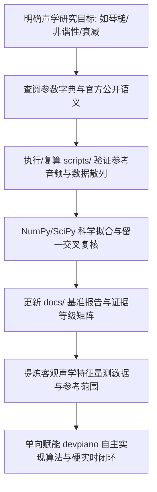

# Project: pianoteq9

你正在协助进行 **pianoteq9** 声学研究与保留音频量测实验室的维护与分析工作。

本项目作为 [`devpiano`](https://github.com/0xnayuta/devpiano) 自主研发高保真物理建模钢琴音源（`PianoSynthVoice`）的专属声学研究前哨，核心职责是通过 **公开参数语义解构、历史静态取证记录整理与可复核的黑盒声学量测**，提炼出商业级物理建模钢琴的核心参数语义、客观物理现象特征与参考数值范围。

**【核心认知红线】彻底放弃“逆向完整原厂物理建模引擎代码”的不切实际幻想**：商业 C++ 二进制经过激进编译优化（/O2, AVX2, 内联展开），彻底抹去了变量名、结构体布局与物理量纲；浮点 SIMD 乘加指令无法逆向反推微观物理机制。本项目只输出可公开解释的数学假说、候选模型与客观量测数据，不提供也不宣称与商业内部实现等价的整器算法。

开发与研究环境采用：**WSL2 Ubuntu 26.04 主工作树 + Windows 11 宿主运行环境 + OpenJDK 21 + Ghidra 12.1.4 + REA 6.3.0 + NumPy / SciPy 信号处理套件**。

---

## 1. 项目边界与目录职责

### 核心工作目录

- `/binaries/`
  - Pianoteq 9 原始上游安装包、程序、插件与文档归档（`Pianoteq 9.exe`、`Pianoteq 9.vst3plugin`、`VST3/` 等）。
  - **受 `.gitignore` 严格排除，严禁提交至版本控制仓库**。
  - **绝对只读**：严禁修改、篡改、打补丁或覆盖其中的专有二进制与资源。
- `/docs/`
  - 核心研究产物与技术文档：
    - [`docs/pianoteq9_parameter_dictionary_and_acoustic_spec.md`](docs/pianoteq9_parameter_dictionary_and_acoustic_spec.md)：参数语义与声学研究字典。
    - [`docs/acoustic_benchmark_report.md`](docs/acoustic_benchmark_report.md)：保留音频量测与证据复核（统一量测口径、证据等级分层与旧主张撤回表）。
    - [`docs/roadmap.md`](docs/roadmap.md)：研究路线与证据状态。
    - `phase1/` ~ `phase5/`：历史静态记录与候选假说（每篇均标注证据等级，旧 C++ 示例已撤下）。
- `/acoustic_lab/`
  - 黑盒声学实验执行与证据保存目录：
    - `midi/`：保留的标准测试 MIDI 序列（版本控制追踪，保障 100% 可重现）。
    - `audio/`：保留参考 WAV 采样（`.gitignore` 排除大体积文件，由本机备份追溯）。
    - `results/task39-1-reference-revalidation/`：经 devpiano Task 39-1 独立复算的轻量结果、方法、claims 与 manifest。
    - `backups/task39-1-20261010/`：本机只读封存包（`.gitignore` 排除），包含原始音频、重建输入快照与 seal 校验散列。
- `/scripts/`
  - 自动化、自包含的 Python 研究工具：
    - `extract_parameters.py`：历史参数提取工具。
    - `run_acoustic_experiments.py`：只读分析现有参考文件、复算谱峰与包络，并执行 JSON 冻结证据检查。
- `/.omp/`
  - OMP Agent 本地配置：
    - `mcp.json`：注册本地 `rea` stdio 服务（规范化指向 `/usr/local/bin/rea mcp`，超时 660 秒），支持 Agent 自动化调用 Ghidra 反编译器。

---

## 2. 核心架构与逆向安全铁律

1. **合法研究与合规红线**：
   - 本项目纯粹用于自主乐器算法研发（Clean-Room Design 与声学机理研究），**严禁制作、集成或分发任何绕过授权、脱壳或激活补丁**（已彻底清除 `ptq912p.dll` / `ptq912w.dll` 等无关第三方文件）。
   - 严禁将专有二进制代码逐字反汇编复制到 `devpiano` 中；Clean-Room 声明不能代替来源和许可核对。
2. **工程事实铁律：为什么“完整逆向商业物理建模代码”是不可能的**：
   - 商业编译器的激进优化彻底摧毁了物理意图；浮点汇编无法证明是“琴弦张力”还是“音板阻尼”。
   - **严禁主观脑补拼凑伪代码**：严禁仅凭字符串锚点或个别浮点常量，就强行结合外部学术论文拼凑所谓的“原厂 C++ 求解器”；严禁将未认证的数学假说宣称为商业内部实现。
   - **深刻吸取前期惨痛教训**：
     - Phase 3 曾错误构造出单声道下完全相位抵消且两阶段能量和达 1.105（违背能量守恒）的矩阵；
     - Phase 5 曾错误使用单位余弦平方，导致能量均值恒为 1/2、频移滑音永不归零；
     - 旧示例在音频内循环疯狂调用 `std::cos`、`std::exp`、`std::pow`，严重违背音频硬实时契约。
     **上述旧 C++ 示例已整块撤下，严禁重新引入或推荐给 devpiano**。
3. **五层证据等级分层法**：
   本仓库文档必须严格区分并标注以下五层边界，严禁层级混淆：
   - **【官方语义】**：来自官方手册与公开规格的明确说明（仅作为参考语义，不等于内部实现）；
   - **【静态记录】**：来自 REA/Ghidra 的确定性只读记录（地址、字符串、槽位立即数、内存分配大小，不外推算法）；
   - **【公开理论】**：经典声学教科书与公开已发表文献定理（属于公开知识，非商业秘密）；
   - **【候选模型】**：未获代码级证实的离散方程、拟合曲线或结构假设（必须明确标为未认证，可证伪）；
   - **【黑盒观测】**：基于特定音频、固定时窗与明确算法测得的客观数据（仅代表该条件下的测量观测，不冒称实琴物理常数）。
4. **与 devpiano 的单向赋能边界**：
   - 对 `devpiano` 仓库的操作仅限于**只读参考**其声学模型架构（`source/Audio/PianoSynthVoice.h`、`PianoTuning.h`、`AcousticSnapshot.h`）。未获用户明确批准前，不得擅自修改 `devpiano` 中的业务代码。
   - devpiano 仅以数据驱动方式吸收可复核量测结果与合理参考范围，自主编写符合其自有“零分配、零锁、零库函数三角”硬实时契约的代码。

---

## 3. 高优先级行动规则

- 保持代码极简、清晰，使用现代 Python 3.10+ 标准库与 NumPy / SciPy 规范。
- **绝不修改 `/binaries/` 下的任何文件**。
- **优先复算现有数据**，`scripts/run_acoustic_experiments.py --json` 必须能在现有保留数据上 100% 验证通过。
- 环境变量持久化保证：无论通过哪个 shell 启动 `rea`，均通过 `/usr/local/bin/rea` 及包装器保证 `JAVA_HOME` 与 `GHIDRA_INSTALL_DIR` 自动注入。

### 3.1 研究期减负与 YAGNI

1. **数据驱动而非代码搬运**：只针对 devpiano 当前声学演进阶段进行针对性量测分析，不搞大而全的商业软件全量复刻。
2. **零残留脚本**：一次性调试代码应整合进 `scripts/` 的模块化工具中，不留散落临时文件。
3. **严格以证据为事实源**：区分“已观测事实（Observation）”、“理论推断（Inference）”与“待验证未知（Unknown）”，报告中必须注明证据等级与复算散列。
---

## 4. 提交信息规范

### 格式

```
<type>: <short description>

<optional body — full sentences, explain what and why>
```

### 类型（`<type>`）

| 类型 | 用途 | 示例 |
|:---|:---|:---|
| `feat:` | 新分析工具或自动化测试脚本 | `feat: add automated unison beating extraction script` |
| `fix:` | 修复脚本、公式拟合或路径配置问题 | `fix: resolve UNC path escaping in powershell headless invocation` |
| `refactor:` | 脚本或实验工作区结构重构 | `refactor: modularize acoustic signal processing pipeline in scripts` |
| `docs:` | 报告、特性清单或指南文档更新 | `docs: update inharmonicity benchmark table with C1-C7 measurements` |
| `chore:` | 工具链依赖、环境或配置维护 | `chore: configure REA MCP integration and update gitignore` |
| `test:` | 新增测试 MIDI 序列或验证用例 | `test: add 6-second C3 sustain decay test MIDI fixture` |
| `style:` | 脚本代码格式化 | `style: format python scripts with ruff/black` |

### 规则

- 短描述使用**祈使语气、英文、小写开头、句尾无句号**。
- 单行不超过 72 字符；需换行时换行前不要有标点。
- 短描述本身应能概括改动。需要更多上下文时，空一行后写 body。
- Body 使用完整英文句子，说明**做了什么**和**为什么**，而非重复代码。
- 多处修改用 `- ` 无序列表分行列出。
- 一个提交只做一件事：不要将相互无关的改动混入同一个提交。

### 禁止

- `update file` / `fix bug` / `misc changes` — 无信息量。
- 中文短描述。
- 超过 72 字符的 subject。
- 将生成的庞大 `.wav` 文件混入提交。

### 参考

本规范遵循 [Conventional Commits](https://www.conventionalcommits.org/) 的子集，与 `devpiano` 提交规范保持高度统一。

---

## 5. 文档维护规则

- 项目总体定位与核心目录说明只写入：[`README.md`](README.md)。
- 物理建模参数字典与声学特性清单写入：[`docs/pianoteq9_parameter_dictionary_and_acoustic_spec.md`](docs/pianoteq9_parameter_dictionary_and_acoustic_spec.md)。
- 声学测量数据、公式与拟合结果写入：[`docs/acoustic_benchmark_report.md`](docs/acoustic_benchmark_report.md)。
- Agent 协同守则与提交规范只写入：[`AGENTS.md`](AGENTS.md)。
- 不要在多个文档中重复维护同一份“当前状态”，数据必须与 `acoustic_lab/results/` 的实测数据保持同步。
- 严禁将未经验证的推断写成确定事实。

---

## 6. 逆向与声学实测专项指令

1. **无头批处理音频渲染模式**：
   - 通过 WSL 调用 Windows 宿主无头模式时，必须显式重定向至 Windows 安装路径并避免 UNC 路径作为工作目录：
     ```powershell
     Set-Location 'E:\Program Files\VST3\Pianoteq 9';
     & '.\Pianoteq 9.exe' --headless --preset '<Preset>' --set-param 'Reverb Switch=Off' --rate 48000 --bit-depth 24 --midi '<MidiPath>' --wav '<WavPath>'
     ```
   - 实验渲染音频必须确保为**纯物理干音**（关闭 Reverb、关闭 EQ、固定麦克风位置）。
2. **高精度分音追踪与非谐性拟合**：
   - 采样率统一锁定为 **48000 Hz**，位深为 **24-bit**。
   - 提取分音前必须加窗（如 Blackman-Harris 窗）并进行不少于 65536 或 131072 点的零填充 FFT，以保证频率分辨率优于 0.7 Hz。
   - 拟合非谐性模型： $f_n = n \cdot f_0 \cdot \sqrt{1 + B \cdot n^2}$，报告必须记录各音符对应的 $R^2$ 拟合优度。
3. **REA 工具调用规范**：
   - 调用 `rea decompile`、`rea search` 时必须使用 Linux 下的**绝对路径**。
   - 优先使用已部署的包装器 `/usr/local/bin/rea`，其内部已自动注入所需的 `JAVA_HOME` 与 `GHIDRA_INSTALL_DIR`。

---

## 7. 推荐工作流与工具决策矩阵

### 7.1 典型研究工作流



### 7.2 工具决策矩阵

| 研究阶段 / 动作 | 唯一首选工具 | 辅助 / 确认工具 | 严格禁止的行为 |
|:---|:---|:---|:---|
| **提取参数名称、树状结构与明文标签** | `scripts/extract_parameters.py` | `strings` / `objdump` | 盲目人工滚动反编译伪代码寻找变量名 |
| **定向函数反编译 / 交叉引用 (XRefs)** | `rea` CLI / MCP (Ghidra 12.1.4) | `objdump -d` | 试图反编译并拼凑完整物理求解器伪代码 |
| **音频渲染与声学规律提取** | `scripts/run_acoustic_experiments.py` | Audacity / 外部分析工具 | 手工打开 DAW 逐个录制，缺少散列与版本追溯 |
| **声学数学特征拟合 ($B$, $\tau_1, \tau_2$)** | `scripts/run_acoustic_experiments.py` / `scipy` | 留一分音复核与多窗残差检验 | 凭主观听感猜测常数，或将单组拟合冒充全琴物理常数 |
| **对标 devpiano 自主实现** | 提供客观声学量测数据与物理参考范围 | devpiano 本地测试用例对照 | 擅自跨仓库修改源码，或向 devpiano 搬运专有汇编/候选求解器 |
---

## 8. 结束输出要求

每轮结束时必须给出：**下一轮建议做什么，哪个或哪些是你最推荐的**。
