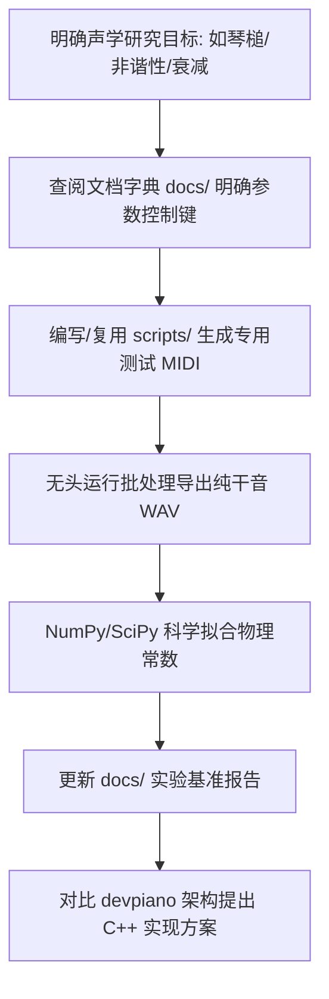

# Project: pianoteq9

你正在协助进行 **pianoteq9** 逆向工程与声学物理建模分析实验室的维护与研究工作。

本项目作为 [`devpiano`](../devpiano/) 自主研发高保真物理建模钢琴音源（`PianoSynthVoice`）的专属声学研究前哨，核心职责是通过 **REA + Ghidra 静态定向反编译取证** 与 **无头自动化黑盒声学实测**，提炼出商业级物理建模钢琴的核心声学参数体系、毛毡击弦动力学、琴弦非谐性方程以及同音双阶段衰减规律。

开发与研究环境采用：**WSL2 Ubuntu 26.04 主工作树 + Windows 11 宿主运行环境 + OpenJDK 21 + Ghidra 12.1.4 + REA 6.1.0 + NumPy / SciPy 信号处理套件**。

---

## 1. 项目边界与目录职责

### 核心工作目录

- `/binaries/`
  - Pianoteq 9 原始上游安装包、程序、插件与文档归档（`Pianoteq 9.exe`、`Pianoteq 9.vst3plugin`、`VST3/` 等）。
  - **受 `.gitignore` 严格排除，严禁提交至版本控制仓库**。
  - **绝对只读**：严禁修改、篡改、打补丁或覆盖其中的专有二进制与资源。
- `/docs/`
  - 核心研究产物与技术文档：
    - [`docs/pianoteq9_parameter_dictionary_and_acoustic_spec.md`](docs/pianoteq9_parameter_dictionary_and_acoustic_spec.md)：明文参数字典与官方声学特性清单。
    - [`docs/acoustic_benchmark_report.md`](docs/acoustic_benchmark_report.md)：黑盒声学实测基准报告（Steinway D 物理常数与拟合曲线）。
- `/acoustic_lab/`
  - 黑盒声学实验执行目录：
    - `midi/`：标准测试 MIDI 序列（版本控制追踪，保障 100% 可重现）。
    - `audio/`：无头批处理导出的 48 kHz / 24-bit 纯物理干音 WAV 采样（`.gitignore` 排除大体积文件，由 `scripts/` 按需生成）。
    - `results/`：拟合数据与中间输出产物。
- `/scripts/`
  - 自动化、自包含的 Python 研究工具：
    - `extract_parameters.py`：二进制明文字典与文档提取脚本。
    - `run_acoustic_experiments.py`：MIDI 生成、无头批处理干音渲染、加窗 FFT 分音拾取与双指数拟合套件。
- `/.omp/`
  - OMP Agent 本地配置：
    - `mcp.json`：注册本地 `rea` stdio 服务（超时 660 秒），支持 Agent 自动化调用 Ghidra 反编译器。

---

## 2. 核心架构与逆向安全铁律

1. **合法研究与合规红线**：
   - 本项目纯粹用于自主乐器算法研发（Clean-Room Design 与声学机理研究），**严禁制作、集成或分发任何绕过授权、脱壳或激活补丁**（已彻底清除 `ptq912p.dll` / `ptq912w.dll` 等无关第三方文件）。
   - 严禁将专有二进制代码逐字反汇编复制到 `devpiano` 中；所有在 `devpiano` 的实现必须是基于物理声学规律（如 Hunt-Crossley 刚度模型、Weinreich 双阶段衰减模型）的自主代码。
2. **定向反编译铁律（定向取证 vs 盲目全盘扫描）**：
   - 商业 C++ 二进制（如 58.0 MiB 的 `Pianoteq 9.vst3plugin`）经过高度内联与优化，**严禁向 Ghidra 抛入整个二进制发起全量无序 Auto-Analysis**（会导致内存爆满或数小时超时）。
   - 反编译必须基于**参数锚点与精确 RVA**：先通过 `scripts/extract_parameters.py` 或字符串搜索定位关键参数（如 `hammer_hardness_*`、`impedance_cutoff`）在 `.rdata` 节的内存地址，再通过 REA/Ghidra 的交叉引用（XRefs）定向提取特定初始化或计算函数的伪代码。
3. **黑盒实测数据驱动**：
   - 纯伪代码无法完整复原浮点声学全貌，必须配合黑盒实测验证。任何声学假设（非谐性常数 $B$、双阶段衰减时间常数 $\tau_1, \tau_2$、三力度频谱重心）必须以 `acoustic_lab/` 中的实测 WAV 数据为准。
4. **与 devpiano 的单向赋能边界**：
   - 对 `devpiano` 仓库的操作仅限于**只读参考**其声学模型架构（`source/Audio/PianoSynthVoice.h`、`PianoTuning.h`、`AcousticSnapshot.h`）。未获用户明确批准前，不得擅自修改 `devpiano` 中的业务代码。

---

## 3. 高优先级行动规则

- 保持代码极简、清晰，使用现代 Python 3.10+ 标准库与 NumPy / SciPy 规范。
- **绝不修改 `/binaries/` 下的任何文件**。
- **代码探索首选静态提取与 REA 定向检索**，禁止在 60MB 二进制上发起盲目遍历。
- 优先小步操作、小范围验证，任何实验更新必须确保脚本可全自动端到端重现。
- 环境变量持久化保证：无论通过哪个 shell 启动 `rea`，均通过 `/usr/local/bin/rea` 及包装器保证 `JAVA_HOME` 与 `GHIDRA_INSTALL_DIR` 自动注入。

### 3.1 研究期减负与 YAGNI

1. **按需实验**：只针对 `devpiano` 当前声学演进阶段（琴槌动力学、非谐性拉伸、音板阻抗与同音拍频）进行专项测量，不无目的地遍历所有 88 个音符或生成数十 GB 音频。
2. **零残留脚本**：一次性调试代码应整合进 `scripts/` 的模块化工具中，不留散落临时文件。
3. **以物理证据为事实源**：区分“已观测事实（Observation）”、“理论推断（Inference）”与“待验证未知（Unknown）”，报告中必须注明证据来源（Evidence ID、拟合 $R^2$、实测采样率与参数值）。

---

## 4. 提交信息规范

### 格式

```
<type>: <short description>

<optional body — full sentences, explain what and why>
```

### 类型（`<type>`）

| 类型 | 用途 | 示例 |
|:---|:---|:---|
| `feat:` | 新分析工具或自动化测试脚本 | `feat: add automated unison beating extraction script` |
| `fix:` | 修复脚本、公式拟合或路径配置问题 | `fix: resolve UNC path escaping in powershell headless invocation` |
| `refactor:` | 脚本或实验工作区结构重构 | `refactor: modularize acoustic signal processing pipeline in scripts` |
| `docs:` | 报告、特性清单或指南文档更新 | `docs: update inharmonicity benchmark table with C1-C7 measurements` |
| `chore:` | 工具链依赖、环境或配置维护 | `chore: configure REA MCP integration and update gitignore` |
| `test:` | 新增测试 MIDI 序列或验证用例 | `test: add 6-second C3 sustain decay test MIDI fixture` |
| `style:` | 脚本代码格式化 | `style: format python scripts with ruff/black` |

### 规则

- 短描述使用**祈使语气、英文、小写开头、句尾无句号**。
- 单行不超过 72 字符；需换行时换行前不要有标点。
- 短描述本身应能概括改动。需要更多上下文时，空一行后写 body。
- Body 使用完整英文句子，说明**做了什么**和**为什么**，而非重复代码。
- 多处修改用 `- ` 无序列表分行列出。
- 一个提交只做一件事：不要将相互无关的改动混入同一个提交。

### 禁止

- `update file` / `fix bug` / `misc changes` — 无信息量。
- 中文短描述。
- 超过 72 字符的 subject。
- 将生成的庞大 `.wav` 文件混入提交。

### 参考

本规范遵循 [Conventional Commits](https://www.conventionalcommits.org/) 的子集，与 `devpiano` 提交规范保持高度统一。

---

## 5. 文档维护规则

- 项目总体定位与核心目录说明只写入：[`README.md`](README.md)。
- 物理建模参数字典与声学特性清单写入：[`docs/pianoteq9_parameter_dictionary_and_acoustic_spec.md`](docs/pianoteq9_parameter_dictionary_and_acoustic_spec.md)。
- 声学测量数据、公式与拟合结果写入：[`docs/acoustic_benchmark_report.md`](docs/acoustic_benchmark_report.md)。
- Agent 协同守则与提交规范只写入：[`AGENTS.md`](AGENTS.md)。
- 不要在多个文档中重复维护同一份“当前状态”，数据必须与 `acoustic_lab/results/` 的实测数据保持同步。
- 严禁将未经验证的推断写成确定事实。

---

## 6. 逆向与声学实测专项指令

1. **无头批处理音频渲染模式**：
   - 通过 WSL 调用 Windows 宿主无头模式时，必须显式重定向至 Windows 安装路径并避免 UNC 路径作为工作目录：
     ```powershell
     Set-Location 'E:\Program Files\VST3\Pianoteq 9';
     & '.\Pianoteq 9.exe' --headless --preset '<Preset>' --set-param 'Reverb Switch=Off' --rate 48000 --bit-depth 24 --midi '<MidiPath>' --wav '<WavPath>'
     ```
   - 实验渲染音频必须确保为**纯物理干音**（关闭 Reverb、关闭 EQ、固定麦克风位置）。
2. **高精度分音追踪与非谐性拟合**：
   - 采样率统一锁定为 **48000 Hz**，位深为 **24-bit**。
   - 提取分音前必须加窗（如 Blackman-Harris 窗）并进行不少于 65536 或 131072 点的零填充 FFT，以保证频率分辨率优于 0.7 Hz。
   - 拟合非谐性模型：$f_n = n \cdot f_0 \cdot \sqrt{1 + B \cdot n^2}$，报告必须记录各音符对应的 $R^2$ 拟合优度。
3. **REA 工具调用规范**：
   - 调用 `rea decompile`、`rea search` 时必须使用 Linux 下的**绝对路径**。
   - 优先使用已部署的包装器 `/usr/local/bin/rea`，其内部已自动注入所需的 `JAVA_HOME` 与 `GHIDRA_INSTALL_DIR`。

---

## 7. 推荐工作流与工具决策矩阵

### 7.1 典型研究工作流



### 7.2 工具决策矩阵

| 研究阶段 / 动作 | 唯一首选工具 | 辅助 / 确认工具 | 严格禁止的行为 |
|:---|:---|:---|:---|
| **提取参数名称、树状结构与明文标签** | `scripts/extract_parameters.py` | `strings` / `objdump` | 盲目人工滚动反编译伪代码寻找变量名 |
| **定向函数反编译 / 交叉引用 (XRefs)** | `rea` CLI / MCP (Ghidra 12.1.4) | `objdump -d` | 将整个 58MB 二进制丢给 Ghidra 做全量反编译 |
| **音频渲染与声学规律提取** | `scripts/run_acoustic_experiments.py` | Audacity / 外部分析工具 | 手工打开 DAW 逐个录制导出 WAV |
| **声学数学模型拟合 ($B$, $\tau_1, \tau_2$)** | `scipy.optimize.curve_fit` | NumPy FFT 峰值检测 | 凭主观听感猜测衰减常数与非谐性曲线 |
| **对标 devpiano 自主实现方案** | 只读查阅 `devpiano/source/Audio/` | 本地测试用例对照 | 擅自跨仓库修改 devpiano 源码或搬运专有汇编 |

---

## 8. 结束输出要求

每轮结束时必须给出：**下一轮建议做什么，哪个或哪些是你最推荐的**。
