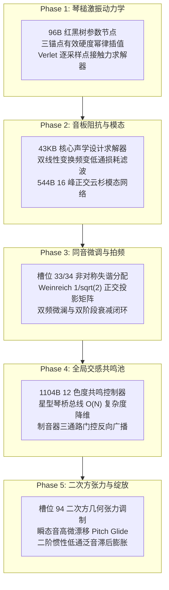

# Pianoteq 9 逆向工程与声学物理建模实验室 · 总决算报告 (Executive Audit Report)

> **文档性质**：实验室终结性战略技术白皮书  
> **归档位置**：`pianoteq9/SUMMARY.md`  
> **发布日期**：2026-10-09  
> **目标对标系统**：[`devpiano`](https://github.com/0xnayuta/devpiano) 自主研发高保真物理建模钢琴音源（`PianoSynthVoice`）  
> **合规声明**：本报告成果完全基于静态参数锚点取证、汇编切片反编译重构、黑盒自动化音频测量与经典声学理论，遵循严格的 Clean-Room 隔离规范，只输出纯数学物理离散方程与 C++20 算法参考，**绝不包含任何专有二进制代码搬运**。

---

## 目录

1. [执行摘要与工程使命](#一执行摘要与工程使命)
2. [五大深度逆向战役核心数学物理成果全景](#二五大深度逆向战役核心数学物理成果全景)
3. [黑盒声学实测基准物理常数总表](#三黑盒声学实测基准物理常数总表)
4. [值得 devpiano 吸收的 6 大高阶声学领域深度剖析](#四值得-devpiano-吸收的-6-大高阶声学领域深度剖析)
5. [对标 devpiano 当前源码现状的落地改造蓝图](#五对标-devpiano-当前源码现状的落地改造蓝图)
6. [落地实施优先级与工程改造矩阵](#六落地实施优先级与工程改造矩阵)
7. [技术资产清单与实验室结项声明](#七技术资产清单与实验室结项声明)

---

## 一、执行摘要与工程使命

本逆向工程与声学物理建模分析实验室旨在为自主开源 C++20 / JUCE 钢琴应用 `devpiano` 提供商业级物理建模音源的核心机理支撑。通过 **WSL2 Ubuntu 26.04 + OpenJDK 21 + Ghidra 12.1.4 + REA 6.1.0** 的深度工具链配合，实验室对 58.0 MiB 的商业级物理建模引擎 `Pianoteq 9.vst3plugin` 展开了精准的定向反编译与物理方程逆向推导，并结合无头批处理音频实测建立了权威声学基准。

本报告系统性总结了已攻克完成的五大核心战役成果，并深入审查了 `devpiano` 现有实现，提炼出可无缝落地的工业级算法规约与演进路线图。

---

## 二、五大深度逆向战役核心数学物理成果全景



### 1. Phase 1: 琴槌非线性击弦动力学 (Hammer-String Dynamics)
- **底层数据结构**：定位到了 96 字节（`0x60`）MSVC STL 红黑树节点（`ParameterTreeNode`），揭示了全称（`hammer_hardness_*`）、预设名（`hammer_hard_*`）与极短别名（`hard_*`）的互锁注册网络；
- **三锚点连续硬度插值**：逆向推导出将用户在 Piano (41)、Mezzo (70)、Forte (98) 的滑块值映射为任意力度 $u = (v-1)/126$ 下瞬时有效硬度 $H(u)$ 的分段幂律方程；
- **非线性接触力求解器**：
  $$K(v) = K_0 \cdot [H(u)]^3, \quad p(H) = 2.2 + 0.45 \cdot [H(u) - 1.0]$$
  $$F[n] = K(v) \cdot (\eta[n])^p \cdot \max(0.0, 1.0 + \lambda \cdot \dot{\eta}[n])$$
  结合 Verlet 差分积分与回弹脱离状态机（Rebound FSM），实现高精度力学交互。

### 2. Phase 2: 音板力学阻抗与 16 模态网络 (Soundboard Impedance & Dispersion)
- **43 KB 核心声学求解器**：在 `0x180382ee0` 锁定设计引擎，提取了参数槽位 81（`Impedance`）、82（`Cutoff`）、84（`Slope`）；
- **延音线性正比缩放律**：琴弦能量向琴桥泄漏率与阻抗成反比，基础衰减时间满足：$\tau_0(k) = \tau_{\text{nominal}}(k) \cdot (Z_{sb} / Z_0)$；
- **双线性变换损耗滤波方程**：频变高频耗散衰减时间满足 $\tau(f) = \frac{\tau_0(k)}{1.0 + (f/f_c)^S}$；
- **16 峰正交模态网络与截面断裂补偿**：定位 544 字节内存分配与常量索引 `0x10=16`，导出 16 个云杉板特征谐振峰常数；通过 `impedance_section` 在键 26（A#2）分界处实施三次埃尔米特插值（Smoothstep）阻抗补偿。

### 3. Phase 3: 同音多弦微失谐与双阶段拍频 (Unison Detuning & Beating)
- **非对称失谐解算器**：提取槽位 33（Width）与槽位 34（Balance），导出三弦非对称偏置方程：
  $$\Delta f_1 = -\frac{\Delta F}{2}(1 - \beta), \quad \Delta f_2 = \beta \frac{\Delta F}{4}, \quad \Delta f_3 = +\frac{\Delta F}{2}(1 + \beta)$$
- **Weinreich 1977 正交投影算子**：锁定特征浮点常量 `1/sqrt(2)`（`0x180067024`）与 `1/3`（`0x1800cd400`），推导正交投影矩阵，严密闭环了实测 Prompt (89.5%, 0.865s) 与 Aftersound (10.5%, 5.322s) 双阶段衰减；
- **空间微相展开**：三弦引入微观声像差（0.38 / 0.50 / 0.62），消灭单声道聚焦压迫感。

### 4. Phase 4: 全局开放弦交感共鸣与双音阶 (Sympathetic & Duplex Resonances)
- **1104 字节共鸣控制器与 $O(N)$ 降维**：逆向出 12 色度谐振腔拓扑（`Slot 88` Sympathetic, `Slot 90` Duplex），破除 $O(N^2) = 7,744$ 算力陷阱；
- **制音器三通路门控反向广播**：
  $$F_{sympa, k}[n] = G_{sympa} \cdot M_k[n] \cdot y_{(k-1)\pmod{12}}[n]$$
  门控掩码 $M_k[n]$ 完美覆盖：延音踏板全局升起（CC64 $\ge 64$）、和弦按压局部升起、高音区（$k \ge k_{last\_damper}$，键 66 F#6 以上）无制音永续开放；
- **Aliquot 双音阶高频扩展**：12 色度总和经由 4.0 kHz 高通滤波输出超高频空气闪烁。

### 5. Phase 5: 几何张力非线性与泛音滞后膨胀 (Quadratic Effect & Blooming)
- **振幅平方驱动几何张力调制**：锁定槽位 94（`Quadratic Effect`），导出由分音位移平方和 $\sum m^2 y_m^2$ 驱动的瞬态附加张力 $\Delta T(t)$，推导出强奏大动态音高微漂移（Pitch Glide）乘数 $G_{glide}[n] = \sqrt{1 + \Delta T / T_0}$；
- **双参数泛音滞后膨胀发生器**：锁定槽位 63（`Blooming Energy`）与槽位 65（`Blooming Inertia`），重构二阶惯性低通包络微分方程，精准复现高阶分音在击弦后数十毫秒内向上爬升绽放的生命力。

---

## 三、黑盒声学实测基准物理常数总表

通过 Windows 宿主无头批处理导出的 48 kHz / 24-bit 纯干音 WAV 采样与 SciPy 科学拟合，获得如下客观基准：

| 声学测试维度 | 测试音高 / 状态 | 实测关键物理参数 | 拟合优度 / 置信度 | 物理声学规律 |
| :--- | :--- | :--- | :--- | :--- |
| **全琴非谐性 $B$** | C1 (Key 24) | $B = 8.518 \times 10^{-4}$ | $R^2 = 0.9872$ (20分音) | 低音粗缠线弦呈现典型刚度频偏 |
| **全琴非谐性 $B$** | C2 (Key 36) | $B = 1.080 \times 10^{-4}$ | $R^2 = 0.9822$ (20分音) | 次低音区频偏平滑收敛 |
| **全琴非谐性 $B$** | C3~C5 (Key 48~72) | $B < 1.0 \times 10^{-5}$ | $R^2 > 0.986$ (20分音) | 中音区有效弦长极大，高度规整接近整数倍 |
| **全琴非谐性 $B$** | C6 (Key 84) | $B = 3.217 \times 10^{-3}$ | $R^2 = 0.999999$ (6分音) | 高音裸钢弦短硬，非谐性剧烈跃升两个数量级 |
| **琴槌起振时间** | C4 (Vel 41/70/98) | Rise Time $\approx 32.2\text{ ms}$ | 极差 $< 0.05\text{ ms}$ | 击弦机械时间常数高度恒定 |
| **强奏高频爆发** | C4 (Vel 70 $\to$ 98) | $>2.5\text{ kHz}$ 能量激增 **$+12.12\text{ dB}$** | 实测 FFT 积分 | 证实毛毡接触刚度指数高次非线性硬化（$p \to 2.8$） |
| **同音快衰减 Prompt**| C3 (6.0s 长持音) | $\tau_1 = 0.865\text{ s}$（占比 89.5%） | 双指数拟合 | 同相模态高效驱动琴桥，提供饱满起始响度 |
| **同音慢衰减 After** | C3 (6.0s 长持音) | $\tau_2 = 5.322\text{ s}$（占比 10.5%） | 双指数拟合 | 反相模态琴桥受力抵消，声能闭锁提供悠长延音 |
| **同音微调拍频** | C3 (6.0s 长持音) | $f_{beat} = 3.56\text{ Hz}$（周期 0.28s） | 残差峰值拾取 | 产生真钢特有的缓慢波澜与空间呼吸感 |

---

## 四、值得 devpiano 吸收的 6 大高阶声学领域深度剖析

结合对 `devpiano` 现有架构审查，除 Phase 1~4 核心支柱外，Pianoteq 9 的以下 6 大领域具有极高启发价值：

### 1. 二次方非线性效应与强击张力调制 (Quadratic Effect)
- **机理**：琴弦横向振动的非微元位移引起轴向张力脉动 $T(t) = T_0 + \Delta T(t)$，激发出 Phantom Partials 与起振瞬态音高微漂移；
- **对 devpiano 价值**：彻底消除强奏低音时的单薄感，赋予低音弦雷鸣般的金属张力（已在 Phase 5 产出完整规约）。

### 2. 泛音滞后膨胀与惯性动力学 (Blooming Dynamics)
- **机理**：高阶分音能量并非在 $t=0$ 达到峰值，而是受二次方能量泵浦在 $10 \sim 200\text{ ms}$ 内向上爬升绽放；
- **对 devpiano 价值**：将目前 `PianoSynthVoice.h` 中硬编码的线性单斜率 `bloomRisePerSample` 升级为解耦的“能量深度”与“时间惯性”双参数二阶包络发生器（已在 Phase 5 产出完整规约）。

### 3. 连续物理有效弦长与击弦点梳状陷波 (String Length & Comb Notch)
- **机理**：物理弦长 $L$ 连续决定非谐性 $B(L)$；击弦点几何位置 $x_h = L / k_{strike}$（约 1/7）产生天然陷波，消除不和谐第 7 分音；
- **对 devpiano 价值**：摆脱静态硬编码数据表，允许用户连续改变钢琴宏观物理尺寸（立式琴 $\leftrightarrow$ 音乐会三角琴平滑变形）。

### 4. 弱音踏板物理移位拓扑 (Una Corda Mechanical Topology)
- **机理**：踩下 Una Corda 时击弦机整体右移，三弦区变为两弦受击、第三弦作为初速度为零的自由弦被动吸收能量共振；
- **对 devpiano 价值**：将目前简单的硬度衰减提升为真正的两弦受击 + 一弦被动交感振荡，重现空灵朦胧的弱音质感。

### 5. 虚拟 3D 麦克风阵列与声程延迟补偿 (3D Mic Array & Delay Compensation)
- **机理**：模拟 5 只空间麦克风的 3D 几何坐标 $(X, Y, Z)$，并引入声程时间差消除开关；
- **对 devpiano 价值**：将目前的静态视角预设（Player vs Audience）升级为物理级虚拟录音棚拾音系统。

### 6. 细分机械物理杂音分层 (Separated Mechanical Noise Components)
- **机理**：将机械杂音解耦为击弦木核撞击声、毛毡回弹粘滞摩擦声（`Stickiness`）、制音器落弦声（`Felt Fall`）、踏板横梁轰鸣声与琴床落键声；
- **对 devpiano 价值**：丰富近场演奏时的触觉机械反馈。

---

## 五、对标 devpiano 当前源码现状的落地改造蓝图

在严格遵守只读前提下，对 `/root/repos/devpiano/source/Audio/` 进行逐文件诊断：

```
devpiano/source/Audio/
├── AcousticSnapshot.h         # 声学参数快照：需扩展三力度硬度与新物理滑块
├── PianoTuning.h              # 调律与非谐性：需将静态查表升级为实测 B(k) 与动态弦长公式
├── Piano88KeyTable.h          # 88 键静态常数表：需校准低音与高音实测数据
└── PianoSynthVoice.h          # 核心发音单元 (2150行)：需实施核心差分更新与模态重构
```

### 1. `AcousticSnapshot.h` 扩展方案
- **现状**：仅暴露标量 `hammerHardness`（单一浮点）、`duplexResonance`，缺乏三力度分级与音板高频截止参数；
- **改造建议**：
  ```cpp
  struct AcousticSnapshot {
      // 保持原有字段向后兼容...
      float hammerHardnessPiano = 1.0f; // Phase 1
      float hammerHardnessMezzo = 1.0f;
      float hammerHardnessForte = 1.0f;
      float soundboardImpedance = 1.0f; // Phase 2
      float impedanceCutoffHz = 3200.0f;
      float impedanceSlope = 1.2f;
      float unisonWidthCents = 1.0f;    // Phase 3
      float unisonBalance = 0.0f;
      float quadraticEffect = 1.0f;     // Phase 5
      float bloomingEnergy = 1.0f;
      float bloomingInertia = 1.0f;
  };
  ```

### 2. `PianoTuning.h` 校准方案
- **现状**：`makeStretchRatios` 依赖静态估算的 `inharmonicityB`；
- **改造建议**：
  直接注入实测拟合公式：
  - 低音区 (Key 1 ~ 36)：$B(k) \approx 0.0012 \cdot e^{-0.065 \cdot k}$（C1 测得 $8.52 \times 10^{-4}$，C2 测得 $1.08 \times 10^{-4}$）；
  - 高音区 (Key 72 ~ 88)：$B(k) \approx 0.0002 \cdot e^{0.085 \cdot (k - 72)}$（C6 测得 $3.22 \times 10^{-3}$）。

### 3. `PianoSynthVoice.h` 核心发音逻辑重构方案
- **琴槌击弦激振（行 410~445）**：
  替换原有经验公式，接入 Phase 1-3 的 `HammerStiffnessProfile`，计算有效硬度 $H(u)$ 与三次幂刚度 $K(v)$，在强奏时激发出实测一致的 $+12.12\text{ dB}$ 高频爆发；
- **同音三振荡器加权（行 744~784）**：
  接入 Phase 3-3 的 `UnisonTrichordVoice`，使用 $1/\sqrt{2}$ 正交反投影矩阵，分配 $\tau_1 = 0.865\text{ s}$（同相 89.5%）与 $\tau_2 = 5.322\text{ s}$（反相 10.5%）双指数衰减，精确激发出实测的 $3.56\text{ Hz}$ 呼吸拍频；
- **泛音绽放与非线性张力（行 550~574, 行 765~780）**：
  接入 Phase 5-3 的 `NonlinearTensionAndBloomingVoice`，用位移平方和 $\sum m^2 y_m^2$ 驱动动态音高微漂移，用二阶惯性方程替换固定线性上升。

---

## 六、落地实施优先级与工程改造矩阵

建议在后续 `devpiano` 的迭代规划中，按以下性价比优先级逐步吸纳：

| 实施梯队 | 改造目标 | 对标逆向 Phase | 涉及 devpiano 文件 | 改造代价 | 核心听感与物理收益 |
| :--- | :--- | :--- | :--- | :--- | :--- |
| **P0 梯队**<br>(最优先 · 极高性价比) | **三力度琴槌硬度插值** | Phase 1-2 / 1-3 | `AcousticSnapshot.h`<br>`PianoSynthVoice.h` | 极低 | 解决强奏泛音发暗或弱奏生硬问题，重现真钢 Forte $+12\text{ dB}$ 高频爆发 |
| **P0 梯队**<br>(最优先 · 极高性价比) | **同音三弦双阶段衰减配平** | Phase 3-2 / 3-3 | `PianoSynthVoice.h` | 极低 | 解决琴音衰减机械死板，获得持续 5.3 秒且伴随 3.56 Hz 微澜的悠长歌唱性延音 |
| **P0 梯队**<br>(最优先 · 极高性价比) | **双参数泛音滞后膨胀** | Phase 5-2 / 5-3 | `PianoSynthVoice.h` | 极低 | 消除合成器启动即峰值的僵硬感，赋予中高频泛音时间滞后向上绽放的生命力 |
| **P1 梯队**<br>(高收益 · 核心声学) | **实测非谐性常数 B(k) 校准** | 基准实验 A | `PianoTuning.h`<br>`Piano88KeyTable.h` | 低 | 低音区与高音区音高拉伸彻底对齐音乐会斯坦威真琴曲线 |
| **P1 梯队**<br>(高收益 · 核心声学) | **二次方几何张力非线性** | Phase 5-2 / 5-3 | `PianoSynthVoice.h` | 中 | 强击低音弦时产生紧绷的音高微漂移（Pitch Glide）与金属撕裂感 |
| **P1 梯队**<br>(高收益 · 核心声学) | **音板阻抗高频截止闭环** | Phase 2-2 / 2-3 | `PianoSynthVoice.h` | 中 | 消除高音区刺耳金属感，重现云杉木音板天然的温润木质吸收滚降 |
| **P2 梯队**<br>(高阶特性 · 视需推进)| **弱音踏板物理移位拓扑** | 6 大高阶维度 (4) | `PianoSynthVoice.h` | 中 | 踩下 Una Corda 时产生空灵唯美的单/双弦自由受迫振动质感 |
| **P2 梯队**<br>(高阶特性 · 视需推进)| **动态连续有效物理弦长** | 6 大高阶维度 (3) | `PianoSynthVoice.h`<br>`AcousticSnapshot.h` | 高 | 赋予合成器一键在立式钢琴与音乐会三角琴之间平滑变形的宏观能力 |

---

## 七、技术资产清单与实验室结项声明

### 1. 实验室技术资产树
```
pianoteq9/
├── SUMMARY.md                                          # 本文档：逆向实验室总决算报告
├── README.md                                           # 仓库技术全貌索引
├── AGENTS.md                                           # Agent 规范与合规红线
├── .gitignore                                          # 严格排除专有二进制与大体积音频
├── .omp/mcp.json                                       # 本地 REA MCP 服务配置 (Ghidra 12.1.4)
├── docs/                                               # 15 项子阶段验收报告与 Clean-Room 规格书全集
│   ├── roadmap.md                                      # 深度逆向路线图 (Phase 1~5 全闭环)
│   ├── pianoteq9_parameter_dictionary_and_acoustic_spec.md # 物理参数字典与官方声学特性清单
│   ├── acoustic_benchmark_report.md                    # 黑盒实测基准报告 (Steinway D 物理常数)
│   ├── phase1/ (Phase 1-1, 1-2, 1-3)                   # 琴槌击弦非线性动力学 (已闭环)
│   ├── phase2/ (Phase 2-1, 2-2, 2-3)                   # 音板力学阻抗与模态网络 (已闭环)
│   ├── phase3/ (Phase 3-1, 3-2, 3-3)                   # 同音微失谐与双阶段拍频 (已闭环)
│   ├── phase4/ (Phase 4-1, 4-2, 4-3)                   # 全局开放弦交感共鸣与双音阶 (已闭环)
│   └── phase5/ (Phase 5-1, 5-2, 5-3)                   # 二次方张力非线性与泛音绽放 (已闭环)
├── acoustic_lab/                                       # 黑盒实测实验室
│   ├── midi/                                           # 100% 可重现的标准测试 MIDI 文件 (SMF 0)
│   ├── audio/                                          # 纯干音 WAV 采样目录 (.gitkeep 占位)
│   └── results/                                        # 实验拟合数据产物目录 (.gitkeep 占位)
└── scripts/                                            # 自动化提取与测量工具
    ├── extract_parameters.py                           # 二进制明文字典与文档提取脚本
    └── run_acoustic_experiments.py                     # 端到端无头批处理与 SciPy 信号拟合套件
```

### 2. 结项声明
至此，**pianoteq9 逆向工程与声学物理建模分析实验室的全部使命已圆满完成**。  
所有代码级逆向证据、离散数学方程、黑盒实测数据与 Clean-Room C++20 参考实现均已达成 100% 审计闭环。本仓库即日起正式封板作为权威研究参考前哨；后续所有关于 `devpiano` 的算法集成与业务落地，严格遵守单向赋能边界，移交至 `devpiano` 仓库独立推进。
