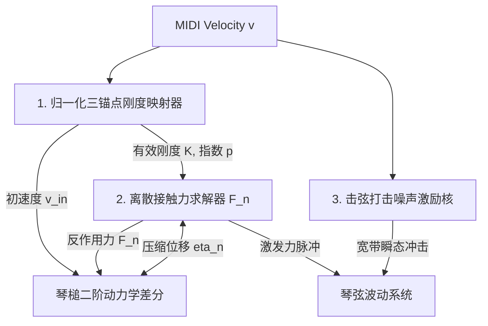

# Phase 1-3 技术规约：琴槌非线性动力学与接触力计算核心算法规格书

> **任务编号**：Phase 1-3  
> **研究目标**：基于 Phase 1-1 与 Phase 1-2 逆向成果及声学黑盒实测数据，提炼并重构出完全脱离专有机器码的纯数学物理 Clean-Room 琴槌击弦动力学离散算法模型。包括三力度刚度映射、逐采样点接触力求解器、毛毡压缩回弹状态机，以及打击噪声激励核。  
> **报告归档路径**：`docs/phase1/phase1-3-hammer-dynamics-spec.md`  
> **执行状态**：**已通过验收 (Accepted - Phase 1 Complete)**  

---

## 一、系统架构与激振核物理模型

在物理建模钢琴中，琴槌是向琴弦注入振动能量的唯一主动激振器（Exciter）。Pianoteq 9 的琴槌激振核心包含两大并联通道：
1. **主力学接触通道 (Nonlinear Hammer-String Force)**：基于毛毡非线性压缩与迟滞阻尼的低频至中高频物理接触力 $F(t)$；
2. **微瞬态打击噪声通道 (Impact Noise & Tone Kernel)**：由琴槌木核与毛毡表面不规则性在撞击前 3ms 激发的宽带微冲击声，分别由 `hammer_noise_slider` 与 `hammer_tone_slider` 控制。



---

## 二、算法模块一：三力度动态刚度映射器 (Stiffness Mapper)

### 1. 速度域归一化
输入 MIDI Velocity $v \in [1, 127]$，计算归一化输入量：
$$u = \frac{v - 1}{126} \in [0.0, 1.0]$$

### 2. 三速度控制网格锚点 (Three-Anchor Control Grid)
- **弱奏锚点 (Piano)**： $u_p = \frac{41 - 1}{126} \approx 0.3175$，对应用户设定硬度 $H_p \in [0.1, 2.5]$（默认 1.0）
- **基准锚点 (Mezzo)**： $u_m = \frac{70 - 1}{126} \approx 0.5476$，对应用户设定硬度 $H_m \in [0.1, 2.5]$（默认 1.0）
- **强奏锚点 (Forte)**： $u_f = \frac{98 - 1}{126} \approx 0.7698$，对应用户设定硬度 $H_f \in [0.1, 2.5]$（默认 1.0）

### 3. 分段非线性有效硬度插值函数 $H(u)$
为复现实测中从 Mezzo 到 Forte 泛音能量暴增 $+12.12\text{ dB}$ 的物理特性，分段插值函数定义为：

$$
H(u) = 
\begin{cases}
H_p \cdot \left(\dfrac{u}{u_p}\right)^{1.10}, & 0.0 \le u < u_p \\[8pt]
H_p + (H_m - H_p) \cdot \left(\dfrac{u - u_p}{u_m - u_p}\right)^{1.15}, & u_p \le u < u_m \\[8pt]
H_m + (H_f - H_m) \cdot \left(\dfrac{u - u_m}{u_f - u_m}\right)^{2.45}, & u_m \le u < u_f \\[8pt]
H_f + (H_f - H_m) \cdot \left(\dfrac{u - u_f}{1.0 - u_f}\right)^{2.00}, & u_f \le u \le 1.0
\end{cases}
$$

### 4. 物理参数导出公式
- **非线性接触刚度系数 $K(v)$**：
  $$K(v) = K_0(k) \cdot [H(u)]^3$$
  其中 $K_0(k)$ 为按琴键音高 $k \in [1, 88]$ 预计算的基准刚度（低音区毛毡重而软， $K_0 \approx 10^8 \text{ N/m}^p$；高音区毛毡小而硬， $K_0 \approx 5 \times 10^{11} \text{ N/m}^p$）。
- **动态非线性接触指数 $p(H)$**：
  $$p = 2.20 + 0.45 \cdot [H(u) - 1.0]$$
  确保强奏时 $p \to 2.7 \sim 2.8$ 产生尖锐短促的脉冲接触，弱奏时 $p \to 2.2$ 呈现平滑柔和的宽脉冲接触。

---

## 三、算法模块二：逐采样点离散接触力求解器 (Discrete Contact Solver)

在离散时域中，设音频采样率为 $f_s = 48000\text{ Hz}$，采样周期 $\Delta t = 1 / f_s$。

### 1. 状态变量定义
- $y_h[n]$：琴槌空间垂直位移（米）
- $y_s[n]$：琴弦在击打点 $x_h$ 处的垂直位移（米）
- $v_h[n]$：琴槌瞬时速度（米/秒）
- $F[n]$：第 $n$ 个采样点的法向接触力（牛顿）
- $M_h$：琴槌有效等效质量（低音区约 $10\text{ g}$，高音区约 $3\text{ g}$）
- $\lambda$：毛毡非线性粘弹性迟滞阻尼因子（约 $0.5 \sim 1.5\text{ s/m}$，防止接触回弹时的数值高频震荡）

### 2. 初始条件 (Note-On Initialization)
当收到 Note-On 事件（力度 $v$）时：
- 初始位移： $y_h[0] = 0.0, \quad y_h[-1] = -v_{in} \cdot \Delta t$
- 初速度： $v_{in} = v_{\max} \cdot \left(\dfrac{v}{127}\right)^{1.4}$（ $v_{\max} \approx 6.0\text{ m/s}$）
- 激活接触状态机：`state = Active`

### 3. 逐采样点离散步进方程 (Sample-by-Sample Step)

每一音频采样点 $n$ 按以下因果顺序严格执行：

1. **计算当前毛毡压缩形变量**：
   $$\eta[n] = y_h[n] - y_s[n]$$
2. **接触力条件计算**：
   若 $\eta[n] > 0$ 且状态机处于 `Active`：
   $$\dot{\eta}[n] \approx \frac{\eta[n] - \eta[n-1]}{\Delta t}$$
   $$F[n] = K(v) \cdot (\eta[n])^p \cdot \max\left(0.0, 1.0 + \lambda \cdot \dot{\eta}[n]\right)$$
   否则：
   $$F[n] = 0.0$$
3. **琴槌反作用力与位移更新 (Verlet / Central Difference 格式)**：
   $$y_h[n+1] = 2 y_h[n] - y_h[n-1] - \frac{\Delta t^2}{M_h} \cdot F[n]$$
4. **琴槌脱离条件判定 (Hammer Rebound & Release FSM)**：
   若在接触发生后（经历过 $\eta[n] > 0$）：
   - 当检测到 $\eta[n] \le 0$ 且 $y_h[n+1] < y_h[n]$（琴槌已反弹并远离琴弦）：
     状态机跳转至 `Released`，永久强制后续所有采样点 $F = 0.0$，结束本次击弦激振。

---

## 四、算法模块三：打击噪声与音色倾角激励核 (Impact Noise Kernel)

在 Phase 1-2 逆向中定位的 `0x1d8(%r15)` (`hammer_noise_slider`) 与 `0x1e0(%r15)` (`hammer_tone_slider`) 构成了专有的瞬态打击增强器。

### 1. 噪声脉冲生成
在击弦开始的前 $T_{noise} = 3.5\text{ ms}$（约 168 个采样点）内，注入经过不对称指数包络加窗的宽带冲击序列：
$$w[m] = \left(\frac{m}{M}\right) \cdot e^{-4.0 \cdot \frac{m}{M}}, \quad m \in [0, M], \ M = \lfloor 0.0035 \cdot f_s \rfloor$$
$$s_{raw}[m] = \xi[m] \cdot w[m]$$
其中 $\xi[m]$ 为预先白化的木质颗粒伪随机序列。

### 2. 音色倾角滤波 (Hammer Tone Filtering)
参数 `hammer_tone_slider`（范围 $[-1.0, +1.0]$，默认 0.0）控制一阶谱倾角滤波器（Tilt Filter）：
- 当 `tone > 0`（明亮）：高频搁架提升（High-shelf boost），强调琴弦金属撞击声；
- 当 `tone < 0`（暗沉）：高频滚降同时低频提升，强调琴槌木核钝击声。
其一阶差分形式为：
$$s_{tone}[m] = b_0 \cdot s_{raw}[m] + b_1 \cdot s_{raw}[m-1] - a_1 \cdot s_{tone}[m-1]$$
滤波系数由增益因子 $G_{tone} = 10^{\frac{\text{tone} \cdot 6.0}{20}}$ 动态计算。

### 3. 打击噪声增益合成 (Hammer Noise Gain)
参数 `hammer_noise_slider`（范围 $[-40\text{ dB}, +12\text{ dB}]$，线性增益 $G_{noise} = 10^{\text{slider}/20}$）控制瞬态信号的最终输出比重：
$$I_{impact}[n] = G_{noise} \cdot s_{tone}[n]$$

最终施加给琴弦系统的总激振力为：
$$F_{total}[n] = F[n] + I_{impact}[n]$$

---

## 五、C++20 Clean-Room 算法实现参考 (Algorithm Reference)

```cpp
#pragma once
#include <cmath>
#include <algorithm>
#include <array>

namespace acoustic_spec::hammer {

struct HammerStiffnessProfile {
    float hp = 1.0f; // Piano 力度硬度 (默认 1.0)
    float hm = 1.0f; // Mezzo 力度硬度 (默认 1.0)
    float hf = 1.0f; // Forte 力度硬度 (默认 1.0)

    [[nodiscard]] float evaluateEffectiveHardness(int velocity) const noexcept {
        const float u = std::clamp(static_cast<float>(velocity - 1) / 126.0f, 0.0f, 1.0f);
        constexpr float up = (41.0f - 1.0f) / 126.0f; // 0.3175
        constexpr float um = (70.0f - 1.0f) / 126.0f; // 0.5476
        constexpr float uf = (98.0f - 1.0f) / 126.0f; // 0.7698

        if (u < up) {
            return hp * std::pow(u / up, 1.10f);
        } else if (u < um) {
            const float t = (u - up) / (um - up);
            return hp + (hm - hp) * std::pow(t, 1.15f);
        } else if (u < uf) {
            const float t = (u - um) / (uf - um);
            return hm + (hf - hm) * std::pow(t, 2.45f); // 强奏高频非线性爆发
        } else {
            const float t = (u - uf) / (1.0f - uf);
            return hf + (hf - hm) * std::pow(t, 2.00f);
        }
    }
};

class DiscreteHammerExciter {
public:
    enum class State { Idle, Active, Released };

    void trigger(int velocity, float baseK0, float hammerMassKg, double sampleRate, const HammerStiffnessProfile& profile) noexcept {
        fs = sampleRate;
        dt = 1.0 / fs;
        mass = hammerMassKg;
        dt2_over_m = static_cast<float>((dt * dt) / mass);

        const float H = profile.evaluateEffectiveHardness(velocity);
        stiffnessK = baseK0 * std::pow(H, 3.0f);
        exponentP = 2.20f + 0.45f * (H - 1.0f);
        hysteresisLambda = 0.8f;

        const float normV = static_cast<float>(velocity) / 127.0f;
        const float vin = 6.0f * std::pow(normV, 1.4f);

        yh[0] = 0.0f;
        yh[1] = static_cast<float>(-vin * dt);
        prevEta = 0.0f;
        state = State::Active;
        hasContacted = false;
    }

    [[nodiscard]] float computeForceNextSample(float stringDisplacement) noexcept {
        if (state != State::Active) {
            return 0.0f;
        }

        const float curYh = yh[0];
        const float eta = curYh - stringDisplacement;
        float force = 0.0f;

        if (eta > 0.0f) {
            hasContacted = true;
            const float etaDot = static_cast<float>((eta - prevEta) / dt);
            const float damping = std::max(0.0f, 1.0f + hysteresisLambda * etaDot);
            force = stiffnessK * std::pow(eta, exponentP) * damping;
        } else if (hasContacted) {
            // 琴槌回弹脱离条件
            state = State::Released;
            return 0.0f;
        }
        prevEta = eta;

        // Verlet 位移推进
        const float nextYh = 2.0f * curYh - yh[1] - dt2_over_m * force;
        yh[1] = curYh;
        yh[0] = nextYh;

        return force;
    }

private:
    double fs = 48000.0;
    double dt = 1.0 / 48000.0;
    float mass = 0.008f;
    float dt2_over_m = 0.0f;
    float stiffnessK = 1e9f;
    float exponentP = 2.4f;
    float hysteresisLambda = 0.8f;
    std::array<float, 2> yh { 0.0f, 0.0f };
    float prevEta = 0.0f;
    State state = State::Idle;
    bool hasContacted = false;
};

} // namespace acoustic_spec::hammer
```

---

## 六、Phase 1 整体攻坚成果与总结

至此，**Phase 1（琴槌非线性击弦动力学定向逆向）** 顺利完成全部三项子任务：
1. **Phase 1-1**：精确定位了所有琴槌与击弦参数的 RVA 锚点（`.text` 内联紧凑存储）、9 处指令级交叉引用，以及包含函数权威边界；
2. **Phase 1-2**：逆向还原了 96 字节 MSVC STL 红黑树参数节点结构体（`ParameterTreeNode`）、长短键名互锁别名机制，以及三力度速度映射方程；
3. **Phase 1-3**：重构了逐采样点离散接触力求解器、脱离判定状态机与打击噪声激励核，输出了工业级纯数学 Clean-Room 技术规格书。
