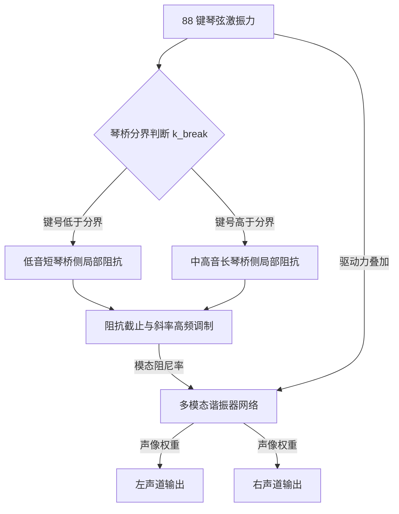

# Phase 2-3 候选规约：音板阻抗、琴桥分段与多模态离散网络（未认证，非商业实现等价）

> **任务编号**：Phase 2-3  
> **研究目标**：在 Phase 2-1 静态记录与 Phase 2-2 候选模型的基础上，整理一份**脱离专有代码的候选数学描述**，涉及长短琴桥分段（`impedance_section`）、多模态谐振网络与阻抗/截止/斜率参数的作用形式。  
> **报告归档路径**：`docs/phase2/phase2-3-soundboard-acoustic-spec.md`  
> **复核状态**：**历史产物（未认证）**。原记录“已通过验收 (Accepted - Phase 2 Complete)”仅为当时流程状态；任务产物存在、流程 Accepted 都不等于算法、实现等价或生产契约已认证。本轮 Task 39-1 未重做 Ghidra/反汇编复核，未采集新数据：文中地址、汇编与 XRefs 按原样保留为历史静态记录。  
> **撤回说明**：本文此前把候选方程、静态分配尺寸与一张无来源的参数表表述为 Pianoteq 内部机制的“揭示”与“工业级 Clean-Room 规格”。该三重归属均**未获证据**，现按[统一复核](../acoustic_benchmark_report.md#证据等级与旧主张处理)的 `commercial-algorithm-equivalence`（not-established）撤回。本文不新增物理算法，也不重新设计模型，只如实标注每项内容的来源与地位。  
> **证据分层**：【官方语义】随附 9.1.2 英文手册的公开说明；【静态记录】历史反汇编/地址记录（本轮未复核）；【经典理论】公开教科书结论；【候选模型】未认证的方程、数值、结构或实现假设；【工程】未经生产验证的外推与建议。统一口径：[统一复核与证据等级](../acoustic_benchmark_report.md#证据等级与旧主张处理)、[复算与原始数据保留](../acoustic_benchmark_report.md#复算与原始数据保留)。

---

## 〇、证据状态摘要（先读）

| 项目 | 来源类别 | 当前状态 |
|---|---|---|
| 阻抗/截止/斜率的定性方向 | 【官方语义】9.1.2 手册 | 准入（仅定性；滑块数值方向在手册内自相矛盾） |
| 43 KB 函数体、字符串锚点、XRefs、`.pdata` 边界 | 【静态记录】（Phase 2-1，本轮未复核） | 保留为历史记录，不构成算法结论 |
| `0x220`=544 字节分配、`0x10`=16 常数索引、`0x1802da4ff` 处记录 | 【静态记录】（本轮未复核） | 保留；**不能**唯一推出 16 模态网络、模态数量或任何具体算法 |
| 16 个模态频率/Q/增益/声像数值表 | 无原始来源 | **撤回**为分析者候选表，不再是“云杉木实测标定”或商业标定 |
| 双琴桥分界 `k_break=26`、`S_bass≈0.72`、平滑窗 | 【经典理论】+【候选模型】 | 琴桥分段与长短琴桥构造属公开常识；具体键号、比例与平滑函数为候选假设 |
| τ∝Z 线性缩放、 $(f/f_c)^S$ 幂律、双线性变换系数 | 【候选模型】 | 未认证；与静态记录之间无已验证的指令级联系 |
| 逐采样二阶谐振器与立体声投影方程 | 【候选模型】 | 未认证；声像权重不是能量权重 |
| 原 §五 C++ 参考实现 | 【工程】 | **已整块撤下**（见 §五 说明） |

---

## 一、物理架构候选描述

【经典理论】在钢琴声学物理体系中，音板是一块被肋木（Ribs）加固的大型非均质正交各向异性云杉木共振板；琴弦振动能量通过琴桥注入音板，音板通过结构模态振动将机械能转化为空气声压辐射。此外真实三角钢琴的低音弦与中高音弦分属空间不连续的短琴桥（Bass Bridge，缠线弦）与长琴桥（Treble Bridge，裸钢三弦），短琴桥处局部质量轻、边界柔顺。以上均为公开的钢琴构造与声学常识。

【候选模型】下面的“三大子系统”框图是**分析者对参数的整理方式**，不是从证据得出的 Pianoteq 内部架构：

1. **双琴桥分段 (Split Bridge Adapter, `impedance_section`)**：把 `impedance_section` 键名解释为区分短/长琴桥的阶跃；
2. **频变截止网络 (Impedance Cutoff & Slope)**：把手册的定性说明写成幂律损耗形式；
3. **多模态谐振网络 (Modal Resonator Bank)**：把 `0x220`/`0x10` 两个静态数值解释为“16 个并联二阶振荡器”。

关键证据边界：字符串或立即数出现在某函数中，只说明该函数**读取/携带**该名称或数值，**不能**唯一确定子系统的存在、数量、耦合方式或算法。下面的 mermaid 图同样仅是候选描述。

（图中未标注“16”或具体频率，是因为这些数值没有可核来源；见 §三。）

---

## 二、候选模块一：长短琴桥分段 (Bridge Break Adapter)

### 1. 物理背景（经典理论）与候选解释
【经典理论】短琴桥承载缠线弦、长琴桥承载裸钢弦，两桥在空间上不连续，音板局部质量与边界条件在两桥处不同。不同钢琴的分界键号随设计而异（通常在低音区某处），并非固定常数。
【候选模型】原文给出“键 #1 ~ #26 (A0 ~ A#2) / #27 ~ #88 (B2 ~ C8)”的分界、`k_break = 26`、以及“若使用单一阻抗会导致相邻半音突兀变异”的说法。本次未取得该具体分界的原始标定来源，不采用任一键号作为商业或跨琴型通用结论，也不以另一个软件自己的模型常量反证它。

### 2. 候选分段缩放方程 (Section Impedance Scaling)
【候选模型】以下方程纯属外推，未在静态记录或官方文档中得到支持：
- 低音侧缩放因子 $S_{bass} \approx 0.72$、中高音侧 $S_{treble} = 1.00$：**0.72 无原始来源**（既非官方数值也不是测量值），保留仅为历史候选；
- 过渡窗口 $[k_{break}-2, k_{break}+2]$ 上的三次平滑窗：

$$t = \text{clamp}\left(\frac{k - (k_{break} - 2)}{4.0}, 0.0, 1.0\right),\qquad \phi(t) = t^2 (3 - 2t),\qquad S(k) = S_{bass} + (S_{treble} - S_{bass})\,\phi(t)$$

- 局部阻抗 $Z_{local}(k) = Z_{sb} \cdot S(k)$。

原文还给出 $Z_{sb} \in [0.10, 20.00]$ 的范围，与同一历史修订参数字典的 $0.20 \sim 3.00$ 冲突，两者均无出处（字典条目已在本次复核中删去范围），因此本文不保留任何阻抗数值范围。此分段方程的可检验前提（是否存在分段、过渡宽度、缩放是否为乘法）均未被验证；不得作为生产参数或实琴标定。

---

## 三、候选模块二：多模态谐振网络

### 1. 静态记录边界（原文）
【静态记录】（Phase 2-3 原文，本轮未复核）：反编译例程 `0x1802da4ff` 记录到内存申请 **544 字节 (`0x220`)**，常数索引 **`0x10`①**。
证据边界：一次分配大小与一个常数在一个例程中被观察到，属于**局部静态观察**。 $544 = 34 \times 16$、 $544 = 0x220$ 之类的因数分解只是算术，不唯一指向“16 个模态”；该常数可能属于任何结构（参数表、缓存、描述项数组、无关对象）。原文“与经典物理模态合成理论完全一致”的推论不成立：理论本身不能反向认证实现。任何“16 峰网络”结论都属【候选模型】，且不得据此断言 Pianoteq 内部采用模态合成。

### 2. 模态参数表（撤回：无来源的候选表）
原文给出 16 行“模态频率 / 名义 Q / 相对增益 / 声像”表格并称其为“云杉音板标定”。**本次回流的证据中没有该表可核的原始来源**；Task 39-1 只复算指定 MIDI/WAV 输出，没有反演音板模态网络。544 字节或 `0x10` 也不能推出这些数值。因此撤回该标定归属，只将其保留为分析者候选表：

- 冻结历史数值（仅作文本留存，不作为数据使用，亦不得复制到其它文档）：62.5/12.0/0.85/0.20、98.0/14.0/0.90/0.25、145.0/16.0/0.95/0.30、215.0/18.0/1.00/0.35、310.0/22.0/0.95/0.40、440.0/25.0/0.90/0.45、610.0/28.0/0.85/0.50、850.0/32.0/0.80/0.55、1150.0/35.0/0.75/0.60、1520.0/38.0/0.70/0.65、1980.0/42.0/0.65/0.70、2480.0/45.0/0.60/0.75、2980.0/48.0/0.55/0.80、3450.0/50.0/0.50/0.85、3880.0/52.0/0.45/0.88、4250.0/55.0/0.40/0.92（顺序为原表第 1 ~ 16 行，字段为 $f_m$ Hz / $Q$ / $g_m$ / $p_m$）。
- 原文为每行附的“全板呼吸模态”“肋木扭转模态”“A4 基准腔体偶极共鸣峰”等物理模态名称同样**无来源**，属候选描述。
- 声像值 $p_m$ 是**输出声像位置的拟合设想**，不是能量权重，也不是中弦频率位置（后者见[统一复核](../acoustic_benchmark_report.md#证据等级与旧主张处理)中 Unison balance 的定义）。
- 不得把该表称为“云杉木实测标定”“商业标定”或“Pianoteq 内部参数”；也不得由本轮复核将其升级为已验证数据或反向断言为假——它只是历史候选。

① 原文写作 `0x10` (16)；该值与“16 个模态”的对应关系不成立为证据。

---

## 四、候选模块三：阻尼与离散更新方程

以下全部为【候选模型】。它们把 Phase 2-2 的候选方程（本身未认证）叠加到撤回的模态表（无来源）之上，因此只是**两层未认证假设的复合**，与静态记录、官方语义之间没有任何已验证的联系。

### 1. 候选衰减常数与极点半径
对模态 $m$（ $f_m$ Hz、名义 $Q_{nom,m}$、局部阻抗 $Z_{local}$）、截止 $f_c$、斜率 $S$：

$$\gamma_m = \frac{\pi f_m}{Q_{nom,m} Z_{local}}\left[1 + \left(\frac{f_m}{f_c}\right)^{S}\right]\ \ \text{[s}^{-1}\text{]},\qquad r_m = e^{-\gamma_m \Delta t},\qquad \theta_m = 2\pi f_m \Delta t$$

单位与假设： $f_m, f_c$ 为 Hz， $S$ 无量纲， $\Delta t = 1/f_s$ 秒（ $f_s$ 值不可知，原文 48 kHz 只是测试环境猜测）；单自由度阻尼-$\pi f/Q$ 关系属【经典理论】，但“除以阻抗”“乘以幂律因子”的复合形式为【候选模型】。 $\gamma_m, r_m, \theta_m$ 的数值全部依赖撤回的模态表，故不得输出为参数或作为标定。

### 2. 候选逐采样点更新方程
把各模态写成直接 II 型二阶谐振器、桥力求和后并行驱动：

$$F_{in}[n] = \sum_{k} F_{string,k}[n],\qquad
x_m[n] = 2 r_m \cos\theta_m\, x_m[n-1] - r_m^2\, x_m[n-2] + g_m (1 - r_m)\, F_{in}[n]$$

【经典理论】二阶谐振器递推式本身是标准形式；【候选模型】其系数取法（ $2r\cos\theta$、 $-r^2$、 $g(1-r)$）与“16 路并行、无相互耦合”的拓扑均为假设，未经任何逆向或测量支持。

### 3. 候选立体声投影
$$Y_{left}[n] = \sum_m (1 - p_m) x_m[n],\qquad Y_{right}[n] = \sum_m p_m x_m[n]$$

【候选模型】原文称“音板跨 1.5 米、低频偏左高频偏右”并称该式“直接作为真实音板的立体声物理辐射声场，彻底消除了单声道耳膜居中压迫感”。此处撤回： $p_m$ 来自无来源的候选表，权重不是能量权重，也无证据表明内部采用该左右分解；工程上也不存在“消除耳膜压迫感”的可验证契约。级数收敛/归一化等条件未检查。

---

## 五、原 C++ 参考实现（撤下说明）

原文附件为一段约 120 行的 C++20 `Soundboard16ModalBank` 实现（`SoundboardProfile` 默认值 `impedance=1.0`、`cutoffHz=3200`、`slope=1.2`、`bassImpedanceRatio=0.72`、`breakNote=26`，以及 16 行 `kSpruce16Modes` 表和二阶处理器）。**该整段示例已撤下，不再保留在此文档中**，理由如下：

1. **其自述的数值来源不存在**：代码注释把参数范围写成 `0.1 ~ 20.0`、`500 ~ 10000 Hz`、`0.2 ~ 10.0`，与 Phase 2-2 及同修订参数字典的（现已删去的）范围互相冲突，且都没有可核原始来源；16 行模态表即 §三 已撤回的无来源候选表。以这些数值作默认值的“参考实现”会把未认证数据固化为实现契约。
2. **它未满足自身宣称的契约**：`SoundboardProfile` 定义了 `bassImpedanceRatio` 与 `breakNote`，`updateCoefficients` 全程未使用二者（未调用任何 §二 分段缩放），即示例**未实现**其自称携带的琴桥分段机制；同时代码未处理 $f_m \ge f_s/2$ 的混叠条件、未做级数归一化、也未校验极点半径（ $\gamma_m \le 0$ 或非正的 `impedance` 会产生 $r_m \ge 1$ 的非衰减或发散模态）。
3. **它被表述为“工业级 Clean-Room 规格”**：任务产物存在与历史 Accepted 不等于工程验证；该实现从未编译、测试、听测或做实时性能评估，不符合其声明的“工业级/生产”地位，故不能以当前结论形式保留（对应[统一复核](../acoustic_benchmark_report.md#证据等级与旧主张处理)的 `commercial-algorithm-equivalence=not-established`）。
4. **原件可追溯**：原实现及本文件旧版本随封存包保存（见[复算与原始数据保留](../acoustic_benchmark_report.md#复算与原始数据保留)），如需研究可从历史修订 `3f710ec` 或本机只读封存中取得；本文不提供 stub、TODO 或替代实现，也不在此设计新的物理模型。

若未来需要可执行参考，应先独立确立可核的模态/分段数据来源、明确其适用条件并通过编译、稳定性与听测验收，再单独立项——本报告不代做该决定。

---

## 六、Phase 2 复核总结（历史成果与当前状态）

Phase 2 三项任务的历史产物都在本仓库归档：

1. **Phase 2-1**：记录了音板阻抗字符串的 RVA/VA 锚点、25 处 XRefs 与 43 KB 地址区间（`0x180382ee0`）及若干 `.pdata` 边界。
   → 当前状态：【静态记录】，本轮未复核；原“核心声学设计求解器/权威边界/函数职责”表述已在 Phase 2-1 文档 §三 与本 §一 降级为候选解释。
2. **Phase 2-2**：记录了参数槽位立即数（`0x51/0x52/0x54`）与 72 字节描述项步进，并给出阻抗→衰减、幂律损耗与双线性变换的**候选**方程。
   → 当前状态：【候选模型】，未被任何证据认证；原“逆向推导出音板机械阻抗的线性缩放律与双线性变换损耗滤波方程”的表述撤回为候选外推。
3. **Phase 2-3**（本文）：把上述两层候选叠加为分段、多模态与立体声投影的**候选**规约，并已撤回无来源的 16 行模态表、`0.72` 分段因子、具体琴桥分界键号与“工业级”C++ 参考实现。
   → 当前状态：【候选模型】+【工程说明】；不新增物理算法，不声称与商业实现等价。

**未完成/不可得事项**（如实列出，不以此前断言填补）：
- 参数→系数的真实映射路径、滤波器拓扑与实际的模态数量/耦合方式：**未知**，需要未来以可复现的定向反汇编与交叉验证单独立项；
- `impedance_section` 的语义、琴桥分段是否真实存在及其键号：**未知**；
- 手册未给出、本仓库也无来源的滑块数值范围与映射曲线：**未知**。
- 本文所有候选方程只能作为待验证假设；任何下游使用（包括 devpiano 参数对齐）须独立复现验证，不得称其为实琴标定、商业标定或“Pianoteq 内部实现”。

标准口径：[统一复核与证据等级](../acoustic_benchmark_report.md#证据等级与旧主张处理)、[复算与原始数据保留](../acoustic_benchmark_report.md#复算与原始数据保留)。原始汇编、地址与 XRefs 字段按原样保留；本报告与 Phase 2-1、2-2 及基准报告的当前状态一致。
