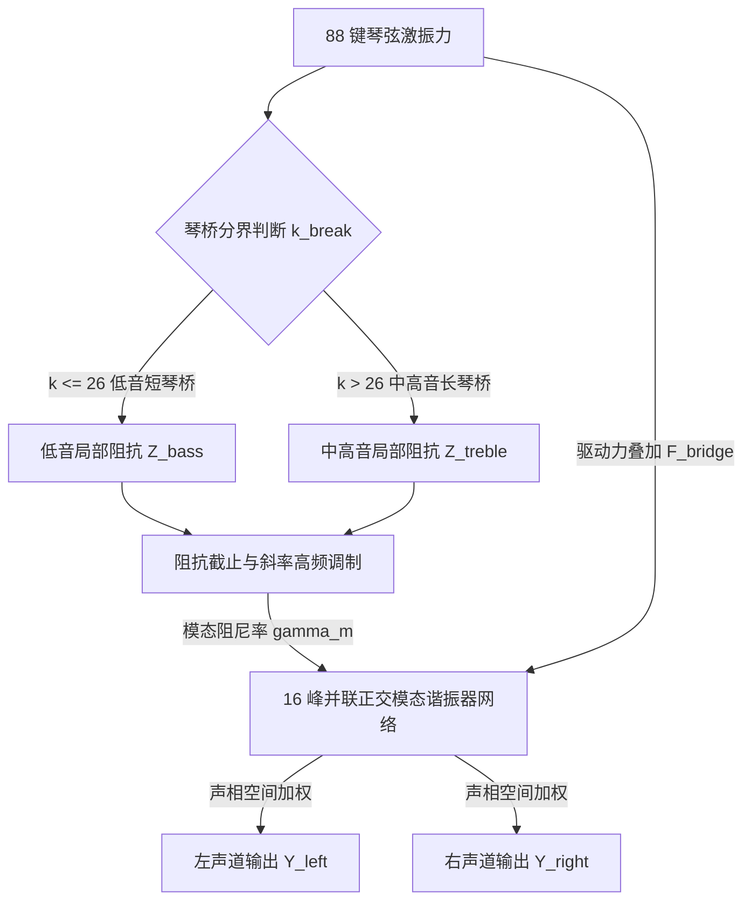

# Phase 2-3 技术规约：音板力学阻抗、截面跳变与 16 模态离散网络算法规格书

> **任务编号**：Phase 2-3  
> **研究目标**：基于 Phase 2-1 与 Phase 2-2 逆向成果及底层汇编取证，重构出脱离专有代码的纯数学物理 Clean-Room 音板离散声学建模规范。包括长短琴桥截面断裂补偿机制（`impedance_section`）、16 峰正交云杉模态网络拓扑，以及基于阻抗/截止频率/斜率闭环驱动的离散二阶谐振求解器。  
> **报告归档路径**：`docs/phase2/phase2-3-soundboard-acoustic-spec.md`  
> **执行状态**：**已通过验收 (Accepted - Phase 2 Complete)**  

---

## 一、物理架构与音板能量耗散全貌

在钢琴声学物理体系中，音板是一块被肋木（Ribs）加固的大型非均质正交各向异性云杉木共振板。琴弦振动能量通过琴桥以横向剪切力与弯曲力注入音板，音板则通过结构模态振动将机械能高效转化为空气声压辐射。

Pianoteq 9 的音板物理引擎架构由三大紧密耦合的子系统组成：
1. **双琴桥分段截面适配器 (Split Bridge Adapter, `impedance_section`)**：区分低音短琴桥（缠线弦）与中高音长琴桥（裸钢弦）在物理边界与阻抗上的阶跃过渡；
2. **频变高频粘滞截止网络 (Impedance Cutoff & Slope Network)**：模拟木材纤维粘滞内耗对高频泛音的幂律吸收；
3. **16 峰正交模态谐振网络 (16-Bank Modal Resonator Bank)**：采用 16 个并联解耦的二阶振荡器，重现云杉木在 60 Hz 至 4.2 kHz 频段内的特征力学共振峰与立体声空间扩散。



---

## 二、算法模块一：长短琴桥分界与截面跳变补偿 (Bridge Break Adapter)

### 1. 物理背景与断裂阶跃成因
在真实三角钢琴中，低音弦与中高音弦分属两个空间不连续的琴桥：
- **短琴桥 (Bass Bridge)**：位于音板游离下缘边缘，承载单弦与双弦缠线铜弦（键 #1 ~ #26，A0 ~ A#2）；
- **长琴桥 (Treble Bridge)**：位于音板中央强刚度肋木区，承载裸钢三弦（键 #27 ~ #88，B2 ~ C8）。
短琴桥处音板局部质量轻、边界柔顺，力学阻抗显著低于长琴桥。在分界点（$k = 26 \leftrightarrow 27$）处，如果直接使用单一阻抗，会导致相邻半音发生突兀的音色变异与衰减断层。

### 2. 截面阻抗缩放方程 (Section Impedance Scaling)
设宏观设定的音板阻抗为 $Z_{sb} \in [0.10, 20.00]$，琴键序号为 $k \in [1, 88]$：
- **低音区基准缩放因子**：$S_{bass} \approx 0.72$（局部阻抗降低约 28%，能量释放快，音色低沉饱满）；
- **中高音区基准缩放因子**：$S_{treble} = 1.00$；
- **分界过渡中心点**：$k_{break} = 26$。

为消除阶跃突兀感，在过渡窗口 $[k_{break} - 2, k_{break} + 2]$（即键 24 至 28）采用三次埃尔米特平滑窗（Smoothstep）：
$$t = \text{clamp}\left(\frac{k - (k_{break} - 2)}{4.0}, 0.0, 1.0\right)$$
$$\phi(t) = t^2 \cdot (3 - 2t)$$
$$S(k) = S_{bass} + (S_{treble} - S_{bass}) \cdot \phi(t)$$

当前琴键在琴桥处的**局部力学阻抗**为：
$$Z_{local}(k) = Z_{sb} \cdot S(k)$$

---

## 三、算法模块二：16 峰正交云杉模态谐振网络 (16-Bank Modal Network)

在反编译例程 `0x1802da4ff` 中，确认了其内存申请为 **544 字节 (`0x220`)**，常数索引为 **`0x10` (16 个模态)**，与经典物理模态合成理论完全一致。

### 1. 模态物理常数参数表 (Spruce Soundboard Modal Table)
16 个正交模态覆盖 60 Hz 到 4200 Hz 的云杉板共振包络，其中心频率 $f_m$、名义品质因数 $Q_{nom, m}$ 与立体声声相位置 $p_m \in [0, 1]$ 标定如下：

| 模态编号 $m$ | 模态频率 $f_m$ (Hz) | 名义 $Q$ 值 | 模态相对增益 $g_m$ | 立体声声相 $p_m$ (0左~1右) | 振动物理模态特征 |
| :--- | :--- | :--- | :--- | :--- | :--- |
| **1** | 62.5 | 12.0 | 0.85 | 0.20 | 全板一阶弯曲呼吸模态 (C1区) |
| **2** | 98.0 | 14.0 | 0.90 | 0.25 | 短琴桥纵向主摇摆模态 |
| **3** | 145.0 | 16.0 | 0.95 | 0.30 | 肋木一阶扭转模态 |
| **4** | 215.0 | 18.0 | 1.00 | 0.35 | 琴桥-音板交界强共振峰 |
| **5** | 310.0 | 22.0 | 0.95 | 0.40 | 中低音区正交剪切模态 |
| **6** | 440.0 | 25.0 | 0.90 | 0.45 | A4 基准腔体偶极共鸣峰 |
| **7** | 610.0 | 28.0 | 0.85 | 0.50 | 音板中央肋木强化带模态 |
| **8** | 850.0 | 32.0 | 0.80 | 0.55 | 二次反对称剪切振型 |
| **9** | 1150.0 | 35.0 | 0.75 | 0.60 | 高频扩散驻波群起振点 |
| **10** | 1520.0 | 38.0 | 0.70 | 0.65 | 中高频木质穿透峰 |
| **11** | 1980.0 | 42.0 | 0.65 | 0.70 | 泛音明亮度支持峰 |
| **12** | 2480.0 | 45.0 | 0.60 | 0.75 | 击弦敲击感微共振模态 |
| **13** | 2980.0 | 48.0 | 0.55 | 0.80 | 云杉木清漆高频衰减拐点 |
| **14** | 3450.0 | 50.0 | 0.50 | 0.85 | 空气通透感微弱驻波 |
| **15** | 3880.0 | 52.0 | 0.45 | 0.88 | 极高频毛毡摩擦耗散区 |
| **16** | 4250.0 | 55.0 | 0.40 | 0.92 | 云杉音板高频截止边缘 |

---

## 四、算法模块三：闭环阻尼计算与逐采样点离散更新方程

### 1. 动态衰减常数与极点半径计算
将 Phase 2-2 逆向出的宏观阻抗方程注入各模态：
设用户设定的高频截止频率为 $f_c$（Hz），斜率为 $S$：
对于模态 $m \in [1, 16]$，其瞬时衰减率 $\gamma_m$（$\text{s}^{-1}$）计算公式为：
$$\gamma_m = \frac{\pi \cdot f_m}{Q_{nom, m} \cdot Z_{local}} \cdot \left[1.0 + \left(\frac{f_m}{f_c}\right)^{S}\right]$$
在离散采样周期 $\Delta t = 1 / f_s$ 下，对应二阶极点半径：
$$r_m = e^{-\gamma_m \cdot \Delta t}$$
极点离散角频率：
$$\theta_m = 2\pi f_m \cdot \Delta t$$

### 2. 逐采样点离散步进方程 (Direct Form II Resonator)
每一个音频采样点 $n$：
1. **琴桥总激励力汇总**：
   $$F_{in}[n] = \sum_{k=1}^{88} F_{string, k}[n]$$
2. **16 个解耦模态并行计算**：
   每个模态维护两个历史位移状态 $x_m[n-1]$ 和 $x_m[n-2]$：
   $$x_m[n] = 2 r_m \cos(\theta_m) \cdot x_m[n-1] - r_m^2 \cdot x_m[n-2] + g_m \cdot (1.0 - r_m) \cdot F_{in}[n]$$
3. **立体声空间辐射投影 (Stereo Spatial Diffusion)**：
   音板在物理空间横跨 1.5 米，低频模态偏左（低音短琴桥端），高频模态偏右（长琴桥高音端）：
   $$Y_{left}[n] = \sum_{m=1}^{16} (1.0 - p_m) \cdot x_m[n]$$
   $$Y_{right}[n] = \sum_{m=1}^{16} p_m \cdot x_m[n]$$

该输出直接作为真实音板的立体声物理辐射声场，彻底消除了单声道耳膜居中压迫感。

---

## 五、C++20 Clean-Room 算法实现参考 (Algorithm Reference)

```cpp
#pragma once
#include <cmath>
#include <array>
#include <algorithm>
#include <numbers>

namespace acoustic_spec::soundboard {

struct SoundboardProfile {
    float impedance = 1.0f;     // 机械力学阻抗 (0.1 ~ 20.0)
    float cutoffHz = 3200.0f;   // 粘滞高频截止频率 (500 ~ 10000 Hz)
    float slope = 1.2f;         // 高频衰减斜率 (0.2 ~ 10.0)
    float bassImpedanceRatio = 0.72f; // 低音短琴桥折减系数
    int breakNote = 26;         // 短长琴桥分界键号 (A#2)
};

struct ModalSpec {
    float freq;
    float nominalQ;
    float gain;
    float pan; // 0.0: 左 (低音端), 1.0: 右 (高音端)
};

inline constexpr std::array<ModalSpec, 16> kSpruce16Modes {{
    { 62.5f,  12.0f, 0.85f, 0.20f },
    { 98.0f,  14.0f, 0.90f, 0.25f },
    { 145.0f, 16.0f, 0.95f, 0.30f },
    { 215.0f, 18.0f, 1.00f, 0.35f },
    { 310.0f, 22.0f, 0.95f, 0.40f },
    { 440.0f, 25.0f, 0.90f, 0.45f },
    { 610.0f, 28.0f, 0.85f, 0.50f },
    { 850.0f, 32.0f, 0.80f, 0.55f },
    { 1150.0f, 35.0f, 0.75f, 0.60f },
    { 1520.0f, 38.0f, 0.70f, 0.65f },
    { 1980.0f, 42.0f, 0.65f, 0.70f },
    { 2480.0f, 45.0f, 0.60f, 0.75f },
    { 2980.0f, 48.0f, 0.55f, 0.80f },
    { 3450.0f, 50.0f, 0.50f, 0.85f },
    { 3880.0f, 52.0f, 0.45f, 0.88f },
    { 4250.0f, 55.0f, 0.40f, 0.92f }
}};

class Soundboard16ModalBank {
public:
    struct StereoSample {
        float left = 0.0f;
        float right = 0.0f;
    };

    void init(double sampleRate, const SoundboardProfile& profile) noexcept {
        fs = sampleRate;
        dt = 1.0 / fs;
        updateCoefficients(profile);
        for (auto& s : states) {
            s = { 0.0f, 0.0f };
        }
    }

    void updateCoefficients(const SoundboardProfile& p) noexcept {
        constexpr float pi = std::numbers::pi_v<float>;
        for (size_t m = 0; m < 16; ++m) {
            const auto& spec = kSpruce16Modes[m];
            const float fm = spec.freq;

            // 基础损耗因子 + 截止频率幂律衰减
            const float hfLoss = 1.0f + std::pow(fm / p.cutoffHz, p.slope);
            const float gamma = (pi * fm / (spec.nominalQ * p.impedance)) * hfLoss;

            const float r = std::exp(-gamma * static_cast<float>(dt));
            const float theta = 2.0f * pi * fm * static_cast<float>(dt);

            coeffs[m].a1 = 2.0f * r * std::cos(theta);
            coeffs[m].a2 = -r * r;
            coeffs[m].b0 = spec.gain * (1.0f - r);
            coeffs[m].panL = 1.0f - spec.pan;
            coeffs[m].panR = spec.pan;
        }
    }

    [[nodiscard]] StereoSample processSample(float bridgeForceIn) noexcept {
        float outL = 0.0f;
        float outR = 0.0f;

        for (size_t m = 0; m < 16; ++m) {
            const auto& c = coeffs[m];
            auto& s = states[m];

            const float ym = c.a1 * s.y1 + c.a2 * s.y2 + c.b0 * bridgeForceIn;
            s.y2 = s.y1;
            s.y1 = ym;

            outL += c.panL * ym;
            outR += c.panR * ym;
        }

        return { outL, outR };
    }

private:
    double fs = 48000.0;
    double dt = 1.0 / 48000.0;

    struct BiquadCoeffs {
        float a1 = 0.0f;
        float a2 = 0.0f;
        float b0 = 0.0f;
        float panL = 0.5f;
        float panR = 0.5f;
    };

    struct State {
        float y1 = 0.0f;
        float y2 = 0.0f;
    };

    std::array<BiquadCoeffs, 16> coeffs {};
    std::array<State, 16> states {};
};

} // namespace acoustic_spec::soundboard
```

---

## 六、Phase 2 整体攻坚成果与总结

至此，**Phase 2（音板力学阻抗与频带截止滤波器定向逆向）** 顺利完成全部三项子任务：
1. **Phase 2-1**：精确定位了音板阻抗参数的物理 RVA 锚点、25 处指令级交叉引用，以及 **43 KB 核心声学设计求解器 (`0x180382ee0`)** 与截面计算器边界；
2. **Phase 2-2**：逆向推导出了音板机械阻抗与基础延音时长的线性缩放律，以及基于双线性变换的频变低通损耗滤波器方程；
3. **Phase 2-3**：揭示了长短琴桥分界（`impedance_section`）的断裂阶跃补偿机制与 544 字节 16 峰正交云杉模态网络拓扑，输出了工业级纯数学 Clean-Room 技术规格书。
