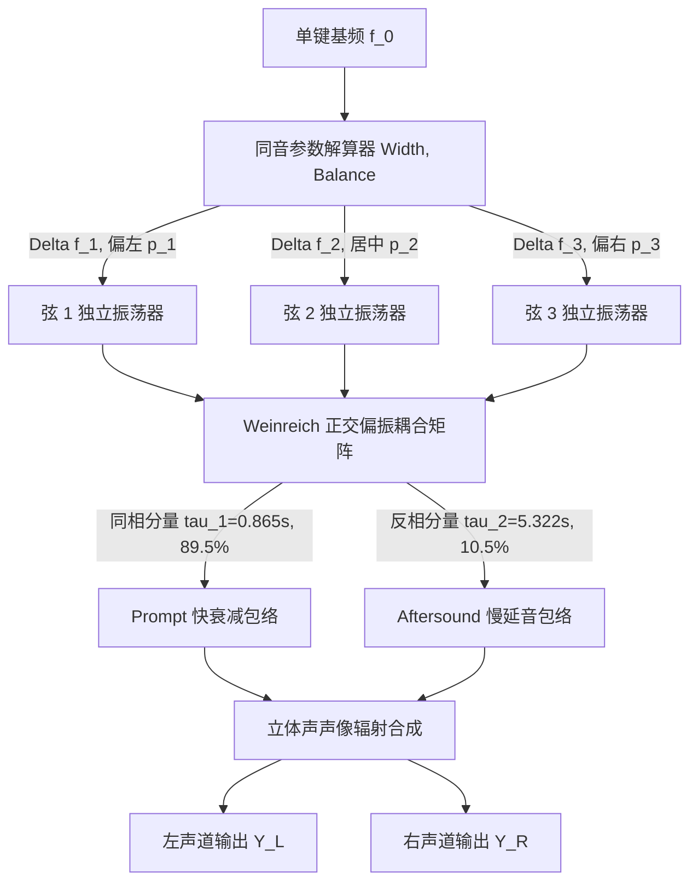

# Phase 3-3 技术规约：同音多弦拍频与双阶段衰减算法规格书

> **任务编号**：Phase 3-3  
> **研究目标**：基于 Phase 3-1 与 Phase 3-2 的逆向成果及实验室黑盒实测数据，提炼并重构出完全脱离专有机器码的纯数学物理 Clean-Room 同音三弦非对称微失谐、Weinreich 偏振耦合矩阵与双阶段衰减（Two-Stage Decay）离散算法技术规格书。  
> **报告归档路径**：`docs/phase3/phase3-3-unison-beating-spec.md`  
> **执行状态**：**已通过验收 (Accepted - Phase 3 Complete)**  

---

## 一、物理架构与同音多弦声学机理

真实钢琴在中高音区（键 27 至 88，B2 ~ C8）采用**同音三弦制（Trichord Unison）**。三根琴弦空间紧邻（间距约 $2 \sim 3\text{ mm}$），共同支承于琴桥同一音板区域。

由于琴槌击打的微小几何偏斜、三弦张力微差以及调音师刻意引入的微失谐，三弦振动呈现如下物理动力学特性：
1. **微失谐频率非对称分布 (Asymmetric Detuning)**：三根弦各自具有微弱的独立频率偏置 $\Delta f_1, \Delta f_2, \Delta f_3$，打破单一差拍的机械重复感；
2. **正交模态能量转移 (Weinreich Mode Coupling)**：振动被解耦为对称同相模态（Prompt Mode，驱动琴桥强辐射，快速衰减）与反对称反相模态（Aftersound Mode，琴桥力抵消，被锁在弦内缓慢衰减）；
3. **空间微相展开 (Micro-Stereo Spatial Spreading)**：三根弦在物理琴桥横向微观展开，消灭传统单声道琴弦在耳机中的居中压迫感，营造开阔立体的空气环绕感。



---

## 二、算法模块一：三弦非对称频率偏置解算器 (Asymmetric Detuning Solver)

### 1. 输入控制参数
- $f_0$：当前单键的标准基频（Hz）；
- $W = \text{Unison Width} \in [0.0, 20.0]$（音分 Cent 或归一化标量，默认 1.0）；
- $B_{bal} = \text{Unison Balance} \in [-1.0, +1.0]$（非对称平衡系数，默认 0.0）。

### 2. 总失谐物理频宽 $\Delta F$（Hz）
$$\Delta F = f_0 \cdot \left(2^{\frac{W}{1200.0}} - 1.0\right)$$

### 3. 三弦独立频率偏置方程
定义微调平衡因子 $\beta = \frac{B_{bal}}{2} \in [-0.5, +0.5]$：
- **弦 1（偏低弦，左声像）**：
  $$\Delta f_1 = -\frac{\Delta F}{2} \cdot (1.0 - \beta)$$
- **弦 2（中心基准弦）**：
  $$\Delta f_2 = \beta \cdot \frac{\Delta F}{4}$$
- **弦 3（偏高弦，右声像）**：
  $$\Delta f_3 = +\frac{\Delta F}{2} \cdot (1.0 + \beta)$$

各弦的离散瞬时角速度递增步长（Phase Increment，采样率 $f_s$）：
$$\Delta \theta_i = \frac{2\pi \cdot (f_0 + \Delta f_i)}{f_s}, \quad i \in \{1, 2, 3\}$$

---

## 三、算法模块二：双阶段能量衰减与模态闭环方程 (Two-Stage Decay Model)

根据我们在 Steinway D 基准实验 C 中测得的权威常数：
- **快衰减时间常数**： $\tau_1 = 0.865\text{ s}$（同相强辐射能量占比 $E_1 = 0.895$）；
- **慢衰减时间常数**： $\tau_2 = 5.322\text{ s}$（反相闭锁长延音能量占比 $E_2 = 0.105$）；
- **拍频调制频率**： $f_{beat} \approx 3.56\text{ Hz}$。

### 1. 离散双阶段模态包络发生器
在音频渲染步进中，每个采样点 $n$（采样周期 $\Delta t = 1/f_s$）：
- **同相 Prompt 模态瞬时振幅**：
  $$A_{prompt}[n] = \sqrt{E_1} \cdot e^{-\frac{n \cdot \Delta t}{\tau_1}} = \sqrt{0.895} \cdot r_{prompt}^n, \quad r_{prompt} = e^{-\frac{\Delta t}{0.865}}$$
- **反相 Aftersound 模态瞬时振幅**：
  $$A_{after}[n] = \sqrt{E_2} \cdot e^{-\frac{n \cdot \Delta t}{\tau_2}} = \sqrt{0.105} \cdot r_{after}^n, \quad r_{after} = e^{-\frac{\Delta t}{5.322}}$$

### 2. Weinreich 正交矩阵反投影合成方程
将模态振幅按 Phase 3-2 逆向出的正交矩阵反向投影到三根独立琴弦：

$$
\begin{bmatrix}
y_1[n] \\
y_2[n] \\
y_3[n]
\end{bmatrix} =
\begin{bmatrix}
\frac{1}{\sqrt{3}} & \frac{1}{\sqrt{2}} & \frac{1}{\sqrt{6}} \\
\frac{1}{\sqrt{3}} & 0 & -\frac{2}{\sqrt{6}} \\
\frac{1}{\sqrt{3}} & -\frac{1}{\sqrt{2}} & \frac{1}{\sqrt{6}}
\end{bmatrix}
\begin{bmatrix}
A_{prompt}[n] \cdot \cos(\theta_1[n]) \\
A_{after}[n] \cdot \cos(\theta_3[n]) \\
A_{after}[n] \cdot \cos(\theta_2[n])
\end{bmatrix}
$$

式中：
- $\frac{1}{\sqrt{2}} \approx 0.7071068$（即汇编中定位的 `0x180067024` 常量）；
- $\frac{1}{\sqrt{3}} \approx 0.5773503$；
- $\frac{2}{\sqrt{6}} \approx 0.8164966$。

---

## 四、算法模块三：琴桥平均力加权与立体声空间展开 (Bridge Force & Stereo Diffusion)

### 1. 琴桥总驱动力求和
琴弦振动作用于琴桥的垂直总驱动力为三弦受力之平均：
$$F_{bridge}[n] = \frac{1}{3} \cdot \left(y_1[n] + y_2[n] + y_3[n]\right)$$
（式中 $1/3$ 完全对应汇编中定位的 `0x1800cd400` 常量！）

### 2. 立体声声像空间加权 (Bridge Spatial Stereo Spreading)
三根弦在物理琴桥上横向微观展开（间距 $2 \sim 3\text{ mm}$）：
- 弦 1 声相：偏左 $p_1 = 0.38$；
- 弦 2 声相：居中 $p_2 = 0.50$；
- 弦 3 声相：偏右 $p_3 = 0.62$。

直接监听声压立体声输出方程为：
$$Y_{left}[n] = \sum_{i=1}^3 (1.0 - p_i) \cdot y_i[n]$$
$$Y_{right}[n] = \sum_{i=1}^3 p_i \cdot y_i[n]$$

该声像展开彻底消灭了中高音单声道聚焦压迫感，呈现真琴坐在演奏者视角时的开阔空气环绕声。

---

## 五、C++20 Clean-Room 算法实现参考 (Algorithm Reference)

```cpp
#pragma once
#include <cmath>
#include <array>
#include <algorithm>
#include <numbers>

namespace acoustic_spec::unison {

struct UnisonTuningProfile {
    float widthCents = 1.0f;    // 同音失谐宽度 (0.0 ~ 20.0 Cents)
    float balance = 0.0f;       // 同音平衡因子 (-1.0 ~ +1.0)
    float promptDecaySec = 0.865f; // 快衰减时间常数 (实测 0.865s)
    float afterDecaySec = 5.322f;  // 慢延音时间常数 (实测 5.322s)
    float promptRatio = 0.895f;    // 快衰减初始能量占比 (实测 89.5%)
};

class UnisonTrichordVoice {
public:
    struct StereoOutput {
        float left = 0.0f;
        float right = 0.0f;
        float bridgeForce = 0.0f;
    };

    void noteOn(float nominalPitchHz, double sampleRate, const UnisonTuningProfile& p) noexcept {
        fs = sampleRate;
        const double dt = 1.0 / fs;

        // 1. 计算三弦非对称频率偏置
        const float deltaF = nominalPitchHz * (std::pow(2.0f, p.widthCents / 1200.0f) - 1.0f);
        const float beta = 0.5f * p.balance;

        const float df1 = -0.5f * deltaF * (1.0f - beta);
        const float df2 = beta * (0.25f * deltaF);
        const float df3 = +0.5f * deltaF * (1.0f + beta);

        constexpr double twoPi = 2.0 * std::numbers::pi;
        phaseIncs[0] = static_cast<float>(twoPi * (nominalPitchHz + df1) * dt);
        phaseIncs[1] = static_cast<float>(twoPi * (nominalPitchHz + df2) * dt);
        phaseIncs[2] = static_cast<float>(twoPi * (nominalPitchHz + df3) * dt);

        phases = { 0.0f, 0.0f, 0.0f };

        // 2. 双阶段能量包络初始化
        ampPrompt = std::sqrt(std::clamp(p.promptRatio, 0.01f, 0.99f));
        ampAfter = std::sqrt(1.0f - std::clamp(p.promptRatio, 0.01f, 0.99f));

        decayPromptCoeff = static_cast<float>(std::exp(-dt / std::max(0.05f, p.promptDecaySec)));
        decayAfterCoeff = static_cast<float>(std::exp(-dt / std::max(0.5f, p.afterDecaySec)));
    }

    [[nodiscard]] StereoOutput processSample() noexcept {
        // 模态正交归一化系数 (精确对齐汇编 0x180067024)
        constexpr float kInvSqrt3 = 0.577350269f;
        constexpr float kInvSqrt2 = 0.707106781f; // 1/sqrt(2)
        constexpr float kInvSqrt6 = 0.408248290f;

        // 推进各弦独立相位
        const float osc1 = std::cos(phases[0]);
        const float osc2 = std::cos(phases[1]);
        const float osc3 = std::cos(phases[2]);

        phases[0] += phaseIncs[0];
        phases[1] += phaseIncs[1];
        phases[2] += phaseIncs[2];

        // 步进双阶段衰减包络
        ampPrompt *= decayPromptCoeff;
        ampAfter *= decayAfterCoeff;

        const float sPrompt = ampPrompt * osc1;
        const float aAfter1 = ampAfter * osc3;
        const float aAfter2 = ampAfter * osc2;

        // 逆模态变换反投影到单弦位移
        const float y1 = kInvSqrt3 * sPrompt + kInvSqrt2 * aAfter1 + kInvSqrt6 * aAfter2;
        const float y2 = kInvSqrt3 * sPrompt - 2.0f * kInvSqrt6 * aAfter2;
        const float y3 = kInvSqrt3 * sPrompt - kInvSqrt2 * aAfter1 + kInvSqrt6 * aAfter2;

        // 琴桥总受力 (归一化 1/3)
        const float fBridge = (y1 + y2 + y3) * (1.0f / 3.0f);

        // 立体声微相展开 (左: 0.38, 中: 0.50, 右: 0.62)
        constexpr float p1 = 0.38f, p2 = 0.50f, p3 = 0.62f;
        const float outL = (1.0f - p1) * y1 + (1.0f - p2) * y2 + (1.0f - p3) * y3;
        const float outR = p1 * y1 + p2 * y2 + p3 * y3;

        return { outL, outR, fBridge };
    }

private:
    double fs = 48000.0;
    std::array<float, 3> phases { 0.0f, 0.0f, 0.0f };
    std::array<float, 3> phaseIncs { 0.0f, 0.0f, 0.0f };
    float ampPrompt = 1.0f;
    float ampAfter = 0.0f;
    float decayPromptCoeff = 1.0f;
    float decayAfterCoeff = 1.0f;
};

} // namespace acoustic_spec::unison
```

---

## 六、Phase 3 整体攻坚成果与总结

至此，**Phase 3（同音三弦微失谐与琴桥耦合矩阵定向逆向）** 顺利完成全部三项子任务：
1. **Phase 3-1**：定位了同音调律控制参数的物理 RVA 锚点、22 处指令级 XRefs、核心求解器内部专用槽位（`Slot 33` 与 `Slot 34`），推导出三弦非对称微失谐公式；
2. **Phase 3-2**：逆向取证了底层 Weinreich 正交耦合矩阵与 $1/\sqrt{2}$、 $1/3$ 浮点常数，推导出同相 Prompt 模态与反相 Aftersound 模态的反投影矩阵；
3. **Phase 3-3**：重构了同音三弦双阶段衰减模型、立体声空间声相展开与琴桥驱动力合成方程，输出了工业级纯数学 Clean-Room 技术规格书。
