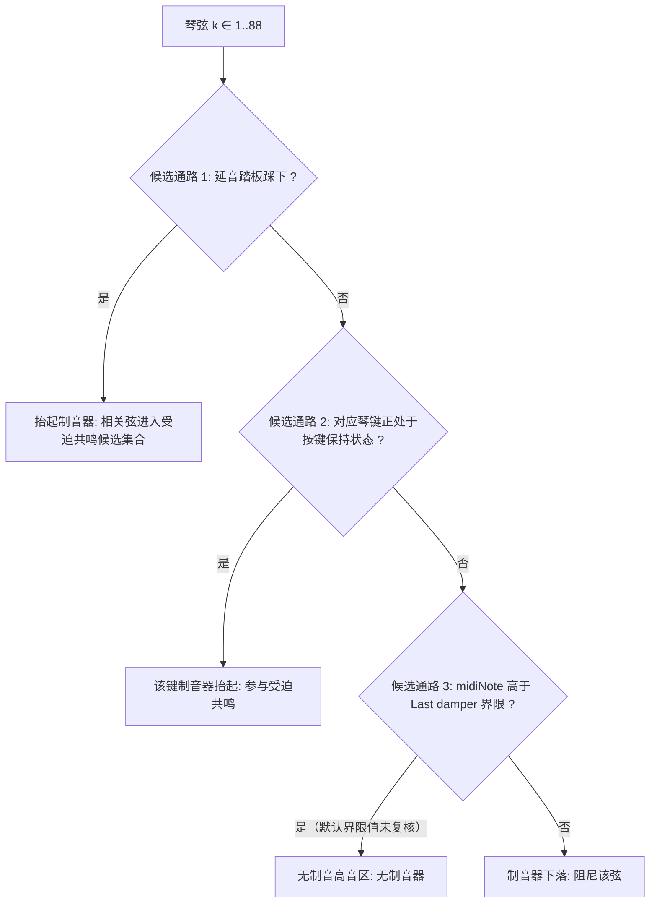

# Phase 4-1 历史报告：开放弦受迫共鸣与制音器门控参数锚点检索

> **任务编号**：Phase 4-1  
> **原研究目标**：在 `binaries/Pianoteq 9.vst3plugin` (58.0 MiB) 中定位全局开放弦交感共鸣、双音阶弦区（Duplex Scale）与制音器控制参数的内存虚拟地址（VA/RVA），提取代码段交叉引用（XRefs），并在 43 KB 核心声学求解器中逆向其内部槽位 ID 及制音器升起状态下的共鸣池触发控制链路。  
> **报告归档路径**：`docs/phase4/phase4-1-sympathetic-anchors-evidence.md`  
> **复核状态**：**历史产物**（原记录“已通过验收 (Accepted)”仅为当时流程状态）。本轮 Task 39-1 未重做 Ghidra/反汇编复核：下文地址、机器码、XRefs 与槽位记录按原样保留为历史静态记录，既不因文档纠错升级为新认证，也不据此反向断言为假。相关等价主张对应[统一复核](../acoustic_benchmark_report.md#证据等级与旧主张处理)中的 `commercial-algorithm-equivalence`（not-established）。  
> **证据标注**：【官方语义】随附 9.1.2 英文手册；【静态记录】历史反汇编/地址记录（本轮未复核）；【经典理论】公开声学/钢琴构造常识；【候选模型】未经认证的解释、方程或数值；【工程】工程外推或建议，除注明外均未生产验证。统一口径：[统一复核与证据等级](../acoustic_benchmark_report.md#证据等级与旧主张处理)、[复算与原始数据保留](../acoustic_benchmark_report.md#复算与原始数据保留)。  

---

## 一、交感共鸣与双音阶参数锚点历史记录 (Resonance Anchors)

【静态记录】通过全二进制特征扫描，在 `.text` 节中定位到如下交感共振与制音器控制参数的物理锚点。地址、偏移与终止符按原样保留，本轮未重新执行扫描或校验；表中“语义角色”列为当时分析者的解释性标注，字符串的存在只证明相应名称被携带：

| 参数键名 / 标签 | 语义角色 | 物理文件偏移 (Raw Offset) | 相对虚拟地址 (RVA) | 绝对虚拟地址 (VA) | 结尾终止符 |
| :--- | :--- | :--- | :--- | :--- | :--- |
| `sympathetic_resonance` | 交感共振主键名 | `0x00080738` | `0x00081338` | `0x0000000180081338` | `\0` (有效独立串) |
| `Sympathetic Resonance` | 交感共振 UI 标签 | `0x0002a9d8` | `0x0002b5d8` | `0x000000018002b5d8` | `\0` (有效独立串) |
| `duplex_scale_resonance` | 双音阶共鸣主键名 | `0x0001bb80` | `0x0001c780` | `0x000000018001c780` | `\0` (有效独立串) |
| `Duplex Scale Resonance`| 双音阶共鸣 UI 标签 | `0x0002d850` | `0x0002e450` | `0x000000018002e450` | `\0` (有效独立串) |
| `sympa_resonance_slider`| 交感滑块短别名 | `0x00017f20` | `0x00018b20` | `0x0000000180018b20` | `\0` (有效独立串) |
| `resonance_duration_view`| 共鸣衰减视图名 | `0x0001a3a8` | `0x0001afa8` | `0x000000018001afa8` | `\0` (有效独立串) |
| `Resonance Duration` | 共鸣衰减时间标签 | `0x0005ac28` | `0x0005b828` | `0x000000018005b828` | `\0` (有效独立串) |
| `last_damper_slider` | 最高音无制音界限 | `0x00046ca0` | `0x000478a0` | `0x00000001800478a0` | `\0` (有效独立串) |

### 三类弦区实体必须分开

| 实体 | 公开语义 | 本仓库状态 |
|---|---|---|
| **开放主弦** | 制音器抬起或未制音的主振动弦段；其受迫共鸣随制音器位置变化 | 【官方语义】+【经典理论】 |
| **Duplex 非发音段** | 调音钉—框架之间（front scale）与琴桥—框架之间（rear scale）的非发音弦段 | 【官方语义】；实现与否未知 |
| **独立 Aliquot 弦** | 特定机型（如 Blüthner）treble 区每键增设的额外完整弦（手册列为机型特征） | 【官方语义】 |

旧稿把 Duplex 与 Aliquot 混称并给出 4–12 kHz 固有频率分布，无来源，已撤回（详见 [Phase 4-3](phase4-3-sympathetic-system-spec.md) §一）。

---

## 二、代码段交叉引用 (XRefs) 历史记录

【静态记录】历史记录称在 `.text` 节中执行滑窗匹配发现 **24 处** 指令级交叉引用。计数、地址与机器码按原样保留，本轮未复核；`lea rdx, [rip + disp32]` 形式的引用只证明对应字符串被相应代码块读取/携带，不证明其算法作用。

### 1. 整音主配置函数中的全局挂载点（`VoicingSetup_Master` 为分析者标签）
- **引用 `sympathetic_resonance` (VA `0x180081338`)**：
  - 指令地址：`0x00000001806c626b` (RVA `0x006c626b`)
  - 机器码：`48 8d 15 c6 b0 9b ff`
  - 汇编：`lea rdx, [rip - 0x644f3a]`
- **引用 `duplex_scale_resonance` (VA `0x18001c780`)**：
  - 指令地址：`0x00000001806c62c7` (RVA `0x006c62c7`)
  - 机器码：`48 8d 15 b2 64 95 ff`
  - 汇编：`lea rdx, [rip - 0x6a9b4e]`
- **上下文关联**【候选模型】（原解释，未认证）：
  当时分析者推断“交感共振与双音阶紧随琴槌硬度之后被统一注册进主声学树，作为全局琴桥振动向被动弦注入能量的耦合开关”。同一注册序列与地址邻接只能说明这些名称出现在相邻代码块中，不能证明该耦合作用或“统一注册”的语义。

### 2. 43 KB 区间中的密集引用群 (`0x180386c24` ~ `0x18038d143`)（“核心求解器”为分析者标签）
- `0x180386c24`: `lea rdx, [rip - 0x35b653]` $\longrightarrow$ `Sympathetic Resonance`
- `0x180386c8e`: `lea rdx, [rip - 0x35b6bd]` $\longrightarrow$ `Sympathetic Resonance`
- `0x180386d3d`: `lea rdx, [rip - 0x3588f4]` $\longrightarrow$ `Duplex Scale Resonance`
- `0x18038d143`: `lea rdx, [rip - 0x331922]` $\longrightarrow$ `Resonance Duration`

---

## 三、43 KB 区间内部槽位 (Internal Slot IDs) 历史记录

【静态记录】以下汇编与槽位立即数为历史反汇编记录，按原样保留，本轮未复核；行内注释为当时分析者标注，不构成认证结论。它们记录“哪些立即数与字符串在同一代码块中被连续处理”，不证明槽位号即官方参数编号，也不证明任何官方取值范围：

```assembly
; === 1. 槽位 0x58 (十进制 88): Sympathetic Resonance (交感共鸣主强度) ===
180386c14:  mov    $0x58, %edx             ; edx = Slot 88 (Sympathetic Resonance)
180386c19:  mov    %rsi, %rcx              ; rcx = DesignContext*
180386c1c:  call   0x1803de5b0             ; 初始化/获取槽位节点
180386c21:  mov    %rax, %rdi
180386c24:  lea    -0x35b653(%rip), %rdx   ; rdx = "Sympathetic Resonance" (VA 0x18002b5d8)
...
180386c63:  call   0x1804a9f30             ; 绑定共鸣槽位属性

; === 2. 槽位 0x59 (十进制 89): Sympathetic Fine / Scale ===
180386c7e:  mov    $0x59, %edx             ; edx = Slot 89
...

; === 3. 槽位 0x5A (十进制 90): Duplex Scale Resonance (双音阶共鸣强度) ===
180386d2b:  mov    $0x5a, %edx             ; edx = Slot 90 (Duplex Scale)
180386d32:  mov    %rsi, %rcx
180386d35:  call   0x1803de5b0
180386d3a:  mov    %rax, %rdi
180386d3d:  lea    -0x3588f4(%rip), %rdx   ; rdx = "Duplex Scale Resonance" (VA 0x18002e450)
...
180386d7c:  call   0x1804a9f30             ; 绑定双音阶槽位属性

; === 4. 槽位 0x5B (十进制 91): Duplex Fine / Scale ===
180386d97:  mov    $0x5b, %edx             ; edx = Slot 91
```

### 核心槽位全景对应（历史观察）
- `Slot 81 (0x51)`: `Impedance` (音板阻抗)
- `Slot 82 (0x52)`: `Impedance Cutoff` (阻抗截止)
- `Slot 84 (0x54)`: `Impedance Slope` (阻抗斜率)
- **`Slot 88 (0x58)`: `Sympathetic Resonance` (交感共振强度)**
- **`Slot 90 (0x5A)`: `Duplex Scale Resonance` (双音阶共鸣强度)**

【静态记录】该对应表为历史观察，本轮未复核。【撤回】原文由此断言“证实 Pianoteq 的声学设计引擎将音板阻抗响应与开放弦交感共振置于同一个连续物理总线中联合求解”。立即数与字符串的相邻处理不能证明参数被置入同一物理总线，也不能证明其联合求解的算法结构；该归属与[统一复核](../acoustic_benchmark_report.md#证据等级与旧主张处理)的 `commercial-algorithm-equivalence`（not-established）一致，予以撤回。

---

## 四、制音器门控的候选模型与官方语义边界

【静态记录】通过 `.pdata` 检索的历史记录给出制音器管理相关函数标签 `DamperMechanics_Manager`（`0x0000000180446bf0` ~ `0x0000000180447885`，3,221 字节；函数名为分析者标签，不是二进制符号），并记录其在代码 `0x180446fd2` 处携带 `last_damper_slider`。以上按原样保留，本轮未复核。

【官方语义】随附 9.1.2 英文手册规定：`Last damper` 指“所有 MIDI 编号**严格大于**该值的琴键无制音器”（`all keys with MIDI note number greater than this value have no damper`）；延音踏板抬起全部制音器，且为连续（progressive）踏板、可做半踏板；同音交感共鸣取决于每个制音器的实际位置，因而随踏板深度变化，而不是二值开关。手册同时说明四个“物理”踏板共有十二种可分配语义（Sostenuto、Harmonic 等），不保证固定 CC 编号。

【候选模型】下列“三通路门控”是当时分析者对触发条件的整理，**不是**经证据确认的内部状态机，也不声称覆盖全部踏板、半踏板与既有音符交互：



1. **候选通路一：延音踏板**：公开 MIDI 标准以 CC64 表示延音踏板，但 Pianoteq 的踏板可重新分配，故此处只写“踏板踩下”。官方语义为踏板抬起制音器、使离键后的弦继续振动；连续踏板与半踏板使“是否抬起”依踏板深度连续变化，不能简化为单一阈值。旧稿“CC64 $\ge 64$ 即 88 键全量、完全连通”的表述不作为结论。
2. **候选通路二：琴键保持**：未踩踏板时按住琴键只抬起该键的制音器，该键可作为被动弦被其他敲击激励（手册描述的实验方法支持“未踩踏板时的受迫共鸣”这一现象类别）；具体门控实现未获证据。
3. **候选通路三：高音无制音区**：官方语义为 `midiNote > Last damper` 的键无制音器；**默认界限值未复核**。旧稿“默认约为 Key 66 / F#6”混用了两种编号：按 `pianoKey = midiNote - 20`，key 66 = MIDI 86（D6），MIDI 66 = F#4，F#6 = MIDI 90（key 70）；三者不能互换。

【未验证边界】踏板深度与阈值映射、Sostenuto 等另设踏板（公开 MIDI 标准分别为 CC66 等，但可重新分配）与延音踏板的交互、离键速度、半踏板及既有音符状态在门控中的处理，均需实际行为验证；本页不称“完美覆盖”或完整状态机。

---

## 五、Phase 4-2 衔接（历史计划）

当时的衔接计划为：在 Phase 4-1 记录的基础上继续定向分析共鸣池例程，设想琴桥驱动力分配形式并提取 `Resonance Duration`（历史记录称相关例程为 `0x1801cf930`）的计算形式，产出 `docs/phase4/phase4-2-resonance-pool-decompilation.md`。该对照产物已归档，其当前状态为历史切片记录加候选模型（见[统一复核与证据等级](../acoustic_benchmark_report.md#证据等级与旧主张处理)）；槽位 88/90 与“三通路”本身仍属未认证的历史观察。
