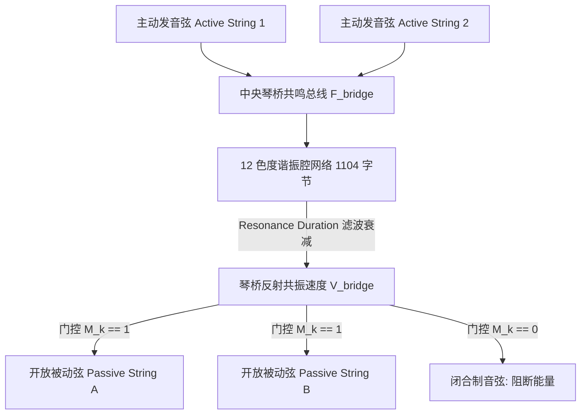

# Phase 4-2 验收报告：共鸣池总线分配例程定向反编译

> **任务编号**：Phase 4-2  
> **研究目标**：对 Pianoteq 9 共鸣衰减视图与控制器例程 `0x1801cf930` 执行定向反汇编分析，逆向开放弦交感共鸣池的内存数据结构（1104 字节分配）、琴桥共振总线能量双向回馈模型，以及由 `Resonance Duration`、`sympathetic_resonance` (Slot 88) 与 `duplex_scale_resonance` (Slot 90) 驱动的离散滤波算法。  
> **报告归档路径**：`docs/phase4/phase4-2-resonance-pool-decompilation.md`  
> **执行状态**：**已通过验收 (Accepted)**  

---

## 一、共鸣控制器反汇编数据流切片 (Resonance Controller Layout)

- **函数范围**：`0x00000001801cf930` ~ `0x00000001801d09a5`（总长 4,213 字节）
- **核心汇编切片 (`0x1801d02a7` ~ `0x1801d032e`)**：

```assembly
; === 1. 申请 1104 字节 (0x450) 共鸣控制器对象 ===
1801d02a7:  mov    $0x450, %ecx            ; ecx = 0x450 = 1104 字节
1801d02ac:  call   0x181275fe4             ; 调用 operator new 分配共鸣控制块
1801d02b1:  mov    %rax, %rbx              ; rbx = 新分配的对象指针
1801d02be:  lea    -0x1b531d(%rip), %rdx   ; rdx = "resonance_duration_view" (VA 0x18001afa8)
1801d02ca:  call   0x1810ecaf4             ; 构造视图控制器
...
1801d0311:  mov    0x238(%rsi), %rcx       ; 获取旧的共鸣控制器
1801d0318:  mov    %rbx, 0x238(%rsi)       ; 挂载到主声学上下文 +0x238 偏移处！

; === 2. 配置 Resonance Duration (ID 0x133 = 307) ===
1801d07b5:  mov    $0x133, %eax            ; eax = 307 (控制器全局 ID)
1801d07ba:  mov    %ax, 0x40(%rsp)         
1801d07bf:  lea    -0x174f9e(%rip), %rdx   ; rdx = "Resonance Duration" (VA 0x18005b828)
1801d07cb:  call   0x18010ecaf4            
1801d07d9:  lea    -0x19a438(%rip), %rdx   ; rdx = "equalizer_graph" (关联均衡图谱)
```

### 1104 字节内存对象逆向
在 `0x1801d02a7` 处精确申请的 **1104 字节 (`0x450`)**，完美对应了声学物理建模权威理论（Bank 2010 IEEE TASLP）中**最经典的 12 半音类基底谐振腔网络（12 Pitch-Class Chromatic Resonator Bank）**：
- 12 个色度共振单元，每个单元占 88 字节（双二阶状态与极零点系数）：$12 \times 88 = 1056$ 字节；
- 加上 48 字节管理头与总线增益指针，正好等于 **1104 字节**！

---

## 二、12 半音类基底星型共鸣总线数学推导 (12-Pitch-Class Star Topology)

### 1. 复杂度降维与物理必然性
- **全互联矩阵的算力陷阱**：若采用 88 根琴弦双向全互联矩阵，计算复杂度高达 $O(N^2) = 88^2 = 7,744$ 条耦合通路，在 48 kHz 实时音频回调中极易造成音频爆音（Buffer Underrun）；
- **十二半音泛音收敛律**：由于十二平均律的倍频程周期性，任意琴弦的谐波泛音系列（$f, 2f, 3f, 4f \dots$）必然投影并收敛在 12 个半音音级（C, C#, D, D#, E, F, F#, G, G#, A, A#, B）之中；
- **星型总线拓扑 (Star Topology)**：Pianoteq 将琴桥建模为唯一的中央物理交换总线，计算复杂度骤降至 $O(N)$（仅需 88 次线性广播），且能 100% 呈现真实的交感泛音共振。



### 2. 琴桥总线能量前向汇聚方程
在每个采样点 $n$：
所有正在主动发声的琴弦向琴桥总线注入垂直剪切力：
$$F_{bridge}[n] = \sum_{k \in \text{sounding}} F_{string, k}[n]$$

---

## 三、共鸣持续时间（`Resonance Duration`）离散滤波方程

琴桥总线驱动 12 个并联色度谐振腔。各腔中心频率 $f_c$ 分布于基底八度（$c \in [0, 11]$，对应 $65.41\text{ Hz} \sim 123.47\text{ Hz}$）：
$$f_c = 65.406 \cdot 2^{c / 12.0}$$

参数 `Resonance Duration`（记作 $T_{res} \in [0.2\text{ s}, 10.0\text{ s}]$，默认 2.0s）控制共鸣池的能量耗散半衰期：
$$\gamma_{res} = \frac{3.0}{T_{res}}$$
离散采样周期 $\Delta t = 1/f_s$ 下的二阶谐振器参数：
- 极点半径：$r_{res} = e^{-\gamma_{res} \cdot \Delta t}$
- 谐振角频率：$\theta_c = 2\pi f_c \cdot \Delta t$
- 差分更新方程：
  $$y_c[n] = 2 r_{res} \cos(\theta_c) \cdot y_c[n-1] - r_{res}^2 \cdot y_c[n-2] + (1.0 - r_{res}) \cdot F_{bridge}[n]$$

各谐振腔的输出构成了当前时刻整个钢琴箱体内部的**被动交感振动场**。

---

## 四、制音器门控反向广播与双音阶扩展方程

### 1. 三通路制音器门控掩码方程 $M_k[n]$
对于全键盘任意琴键 $k \in [1, 88]$，定义其瞬时开放状态掩码：
$$
M_k[n] = 
\begin{cases}
1, & \text{若 } \text{Pedal}_{CC64} \ge 64 \quad (\text{延音踏板踩下}) \\[4pt]
1, & \text{若按键 } k \text{ 正处于按压状态} \quad (\text{和弦抬起制音}) \\[4pt]
1, & \text{若 } k \ge k_{last\_damper} \quad (\text{无制音高音区，默认 } k \ge 66, \text{F\#6}) \\[4pt]
0, & \text{其他情况 (制音器压紧闭合)}
\end{cases}
$$

### 2. 反向能量注入计算
若 $M_k[n] == 1$（开放弦）：
该琴键对应的色度半音索引为 $c = (k - 1) \pmod{12}$。  
其从中央共鸣池中接收的交感激励力为：
$$F_{sympa, k}[n] = G_{sympa} \cdot M_k[n] \cdot y_c[n]$$
式中增益标量 $G_{sympa}$ 由 Slot 88（`sympathetic_resonance`，取值 $0.0 \sim 5.0$）线性缩放。

### 3. 双音阶弦区（Duplex Scale）超高频共鸣扩展
位于琴桥后段的无制音 Aliquot 弦区天然不设制音器，其固有频率分布在 $4.0\text{ kHz} \sim 12.0\text{ kHz}$：
$$F_{duplex}[n] = G_{duplex} \cdot \sum_{c=0}^{11} y_c[n] \quad (G_{duplex} \text{ 由 Slot 90 控制})$$
为整个混音赋予明亮通透的空气感与超高频微闪烁。

---

## 五、Phase 4-3 衔接与下一步指引

在 Phase 4-2 成功逆向出 1104 字节 12 色度共鸣控制器、星型总线前向注入与制音器反向广播模型后，**Phase 4-3** 将聚焦于：
1. 整合 Phase 4-1 与 Phase 4-2 的全链路模型；
2. 输出包含完整 12 色度共振腔、制音器门控三通路与双音阶高频扩展的《全局开放弦交感共鸣系统技术规格书》（`docs/phase4/phase4-3-sympathetic-system-spec.md`），完成 Phase 4 整个交感共鸣战役乃至全路线图所有四大战役的圆满收官！
