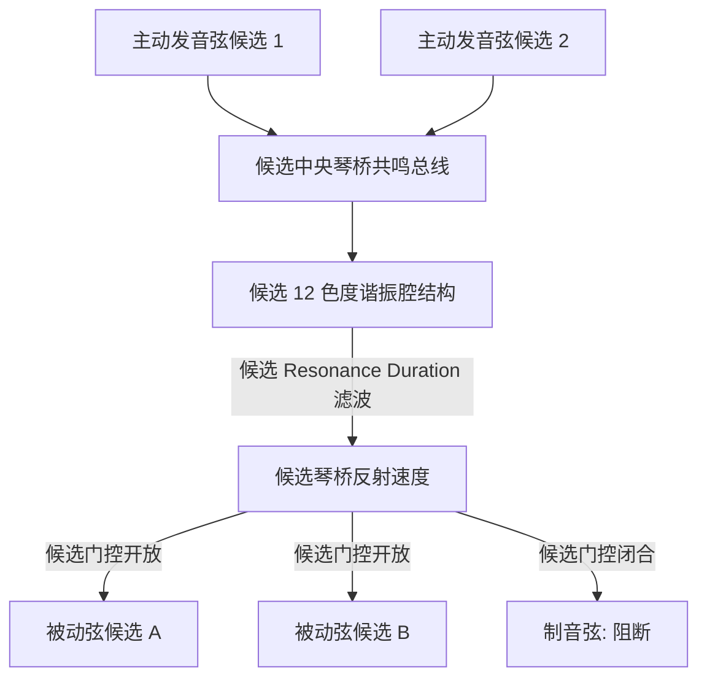

# Phase 4-2 历史报告：共鸣池例程反汇编切片与候选模型

> **任务编号**：Phase 4-2  
> **原研究目标**：对 Pianoteq 9 共鸣衰减视图与控制器例程 `0x1801cf930` 执行定向反汇编分析，尝试解释开放弦交感共鸣池的内存数据结构、琴桥总线能量回馈形式，以及由 `Resonance Duration`、`sympathetic_resonance` (Slot 88) 与 `duplex_scale_resonance` (Slot 90) 驱动的滤波算法。  
> **报告归档路径**：`docs/phase4/phase4-2-resonance-pool-decompilation.md`  
> **复核状态**：**历史产物**（原记录“已通过验收 (Accepted)”仅为当时流程状态）。本轮 Task 39-1 未重做 Ghidra/反汇编复核：汇编切片、地址与槽位记录按原样保留为历史静态记录，既不升级为新认证，也不据此反向断言为假。相关等价主张对应[统一复核](../acoustic_benchmark_report.md#证据等级与旧主张处理)中的 `commercial-algorithm-equivalence`（not-established）。  
> **证据标注**：【官方语义】随附 9.1.2 英文手册；【静态记录】历史反汇编/地址记录（本轮未复核）；【经典理论】公开声学/钢琴构造常识；【候选模型】未经认证的解释、方程或数值；【工程】工程外推或建议，除注明外均未生产验证。统一口径：[统一复核与证据等级](../acoustic_benchmark_report.md#证据等级与旧主张处理)、[复算与原始数据保留](../acoustic_benchmark_report.md#复算与原始数据保留)。  

---

## 一、共鸣控制器反汇编数据流切片 (Resonance Controller Layout)

【静态记录】函数范围与汇编切片为历史记录，按原样保留；地址邻接不证明下列注释中的任何算法结论：

- **函数范围（历史记录）**：`0x00000001801cf930` ~ `0x00000001801d09a5`（总长 4,213 字节）
- **数据流切片（历史记录，`0x1801d02a7` ~ `0x1801d032e`）**：

```assembly
; === 1. 申请 1104 字节 (0x450) 共鸣控制器对象 ===
1801d02a7:  mov    $0x450, %ecx            ; ecx = 0x450 = 1104 字节
1801d02ac:  call   0x181275fe4             ; 调用 operator new 分配共鸣控制块
1801d02b1:  mov    %rax, %rbx              ; rbx = 新分配的对象指针
1801d02be:  lea    -0x1b531d(%rip), %rdx   ; rdx = "resonance_duration_view" (VA 0x18001afa8)
1801d02ca:  call   0x1810ecaf4             ; 构造视图控制器
...
1801d0311:  mov    0x238(%rsi), %rcx       ; 获取旧的共鸣控制器
1801d0318:  mov    %rbx, 0x238(%rsi)       ; 挂载到主声学上下文 +0x238 偏移处！

; === 2. 配置 Resonance Duration (ID 0x133 = 307) ===
1801d07b5:  mov    $0x133, %eax            ; eax = 307 (控制器全局 ID)
1801d07ba:  mov    %ax, 0x40(%rsp)         
1801d07bf:  lea    -0x174f9e(%rip), %rdx   ; rdx = "Resonance Duration" (VA 0x18005b828)
1801d07cb:  call   0x18010ecaf4            
1801d07d9:  lea    -0x19a438(%rip), %rdx   ; rdx = "equalizer_graph" (关联均衡图谱)
```

以上行内注释为**当时分析者的原始标注**，按原样保留；其“operator new/构造视图控制器/主声学上下文”等语义为本轮**未复核**的解释，不构成算法结论。

### 1104 字节分配的候选解释（已降级）
【静态记录】立即数 `0x450` = 1104 字节与相邻字符串 `resonance_duration_view` 属实。

【撤回】原文由此断言该分配“完美对应”Bank 2010 的 12 半音类基底谐振腔网络，并以 $12 \times 88 + 48 = 1104$ 的算术“精确”证明该结构。分配大小与字符串不能唯一确定对象布局、单元数量或算法：$12 \times 88 + 48$ 只是事后选出的一个能凑出 1104 的组合（88 字节/单元与 48 字节头部本身无独立来源），也可由其他划分方式凑出同一字节数。该“结构还原”按[统一复核](../acoustic_benchmark_report.md#证据等级与旧主张处理)的 `commercial-algorithm-equivalence`（not-established）处理，不作为结论。

---

## 二、12 半音类星型总线的候选模型 (12-Pitch-Class Star Topology)

以下内容为【候选模型】，由公开声学常识与历史静态记录外推而来，本轮无任何证据表明 Pianoteq 内部实现了这些方程、拓扑或复杂度级别：

### 1. 复杂度论证的重述与边界
- 【经典理论】若对 $N$ 根弦做双向全互联耦合，通路数按 $O(N^2)$ 增长；在实时音频回调中控制单样本成本是公开的工程常识。
- 【候选模型】“十二半音泛音收敛律”把平均律谐波的音级重合当作可投影到 12 个半音音级（C…B）的充分理由，并据此宣称星型总线把复杂度降到 $O(N)$ 且能“100% 呈现”真实交感泛音共振。“100%”无任何测量或代码依据，撤回；谐波在音级上的分布关系与“12 个色度谐振腔足以表达全琴体被动场”之间没有已证联系。



### 2. 琴桥总线汇聚形式的候选方程
【候选模型】在每个采样点 $n$ 把所有主动发声弦的注入力按代数和相加：
$$F_{bridge}[n] = \sum_{k \in \text{sounding}} F_{string, k}[n] \quad [\text{力, 单位取决于 } F_{string,k} \text{ 的定义}]$$
该求和式是常见的耦合入口写法，此处仅作为候选整理；没有证据表明内部使用该式、其符号约定或各项的物理量纲。

---

## 三、共鸣持续时间滤波的候选方程

【候选模型】原文以 `Resonance Duration` 记作 $T_{res} \in [0.2\text{ s}, 10.0\text{ s}]$（默认 2.0 s）并写出耗散率 $\gamma_{res} = 3.0 / T_{res}$、极点半径 $r_{res} = e^{-\gamma_{res}\Delta t}$ 与并联二阶谐振腔递推式，其中各腔中心频率取基底八度 $c \in [0, 11]$：
$$f_c = 65.406 \cdot 2^{c / 12.0}\ \text{Hz}$$
$$y_c[n] = 2 r_{res} \cos(\theta_c) \cdot y_c[n-1] - r_{res}^2 \cdot y_c[n-2] + (1.0 - r_{res}) \cdot F_{bridge}[n],\qquad \theta_c = 2\pi f_c \Delta t$$

边界说明：

- $T_{res}$ 的范围、默认值、端点与单位语义**未复核**：随附手册与参数字典均未给出该滑块的数值范围，`0.2~10.0 s` 与 `2.0 s` 无原始来源。
- $\gamma_{res} = 3.0 / T_{res}$ 的系数 `3.0`、`1 - r` 的输入标定与“12 路并联、无相互耦合”的拓扑**均无证据**。
- 二阶谐振器递推式本身属【经典理论】；把 $2r\cos\theta$、$-r^2$、$(1-r)$ 的取法说成“逆向得到的 Pianoteq 内部滤波器”**已撤回**。没有任何已记录切片显示该例程执行这些浮点更新。
- 各腔输出“构成整个钢琴箱体内部的被动交感振动场”【撤回】：无证据表明所选频率、通道数与内部声压场结构一致。

---

## 四、制音器门控反向广播与双音阶扩展的候选模型

### 1. 候选门控掩码方程 $M_k[n]$
【候选模型】当时把门控写成对全键盘任意琴键 $k \in [1, 88]$ 的掩码：

$$
M_k[n] = 
\begin{cases}
1, & \text{候选: 延音踏板踩下（公开标准 CC64）} \\[4pt]
1, & \text{候选: 对应琴键处于按键保持状态} \\[4pt]
1, & \text{候选: 对应 midiNote 大于 Last damper 界限（默认值未复核）} \\[4pt]
0, & \text{其他情况}
\end{cases}
$$

注意（本轮纠错）：第三支的判据是 **MIDI 编号**（手册原文 `MIDI note number greater than this value`），而掩码索引 $k$ 为琴键序数；两者按 `midiNote = pianoKey + 20` 换算，混用会产生 20 键的系统性偏移。

【官方语义】9.1.2 手册只规定 `Last damper` 为“MIDI 编号**严格大于**该值的键无制音器”，且延音踏板是连续/半踏板面而非二值开关，同音共鸣随各制音器实际位置变化。

【未验证边界】踏板深度与阈值映射、Sostenuto 等另设踏板（公开 MIDI 标准分别为 CC66 等，但可重新分配）的交互、离键速度与既有音符状态均未在本仓库验证；本页不称“完美覆盖”或完整状态机。编号语义按 `pianoKey = midiNote - 20`（MIDI 21–108）统一，防止 key66/MIDI66/F#6 混用。

### 2. 候选反向注入方程
【候选模型】当 $M_k[n] = 1$ 时按色度索引 $c = (k - 1) \bmod 12$ 注入：
$$F_{sympa, k}[n] = G_{sympa} \cdot M_k[n] \cdot y_c[n]$$
式中 $G_{sympa}$ 由 Slot 88 线性缩放的**说法撤回**：Slot 88 到 `sympathetic_resonance`（或任何增益）的映射属历史观察，$0.0 \sim 5.0$ 的范围亦无可核来源。

【撤回】此外，该“键号取模”的色度索引本身不成立：按 `pianoKey = midiNote - 20`，key 1 = A0（MIDI 21），$c = (1-1) \bmod 12 = 0$ 却把 A0 计入 **C** 索引——**C 基准的 12 音级池不能把 key 1 = A0 映射到 C**；音级索引必须由 MIDI 编号（或等价音高）导出。该索引只是沿用 §二 候选拓扑的产物，未获证据，其后续反向注入方程因此不能作为音级正确的候选。

### 3. 候选双音阶扩展方程
【候选模型】原文把 Duplex 输出写为 12 腔输出之和经 4 kHz 高通后由 $G_{duplex}$ 缩放：
$$F_{duplex}[n] = G_{duplex} \cdot \text{Highpass}_{4k}\left(\sum_{c=0}^{11} y_c[n]\right)$$

【撤回/边界】
- 【官方语义】手册定义 Duplex scale 共鸣来自由调音钉与框架之间（front scale）以及琴桥与框架之间（rear scale）的非发音弦段，并称该结构由 Steinway 于 1872 年申请专利；**不是**“琴桥后段”单一位置。
- “4 kHz 高通”“$4.0\sim12.0\text{ kHz}$ 固有频率分布”“由 Slot 90 线性控制”“空气感/超高频微闪烁”均为未认证外推：高通滤波器**不是**无激励能量生成器，也不能证明非发音段受迫模型的存在；Slot 90 到增益的线性映射与 `0.0~20.0` 范围无原始来源。
- Duplex 与 Aliquot 是**不同**构造：Aliquot（Blüthner 等）是额外的完整弦，随附手册将其单列为机型特征；不能把两者互换，也不能称本仓库已还原任一结构。

---

## 五、Phase 4-3 衔接（历史计划）

当时的衔接计划为把 4-1/4-2 的整理合并为一份系统规格书（`docs/phase4/phase4-3-sympathetic-system-spec.md`），并宣称“圆满收官”。该规约文件已归档；原文中把 1104 字节分配与星型总线当作已确立结构的表述在本轮按上述边界降级，任务产物完成不等于内部机制已被证明。
