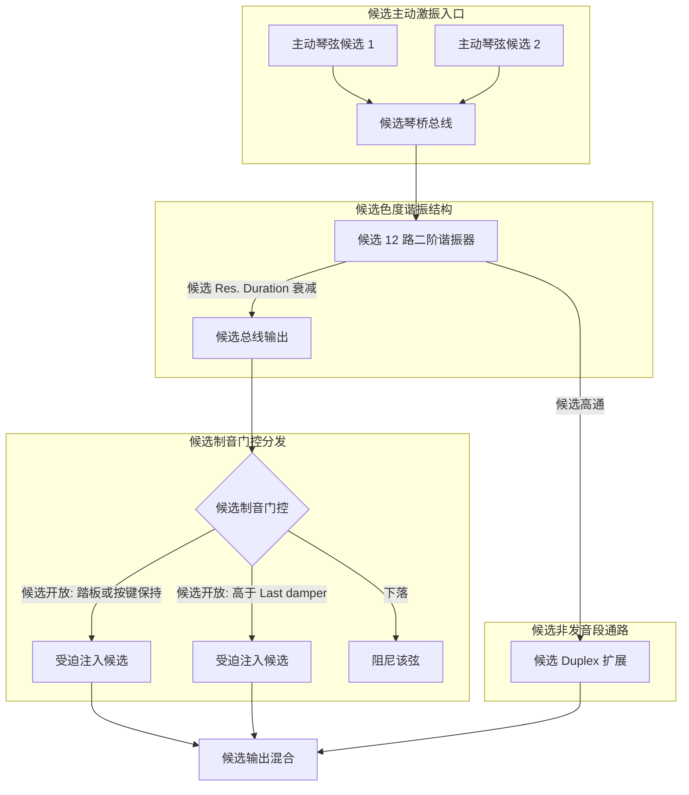

# Phase 4-3 候选规约：开放弦受迫共鸣与非发音段整理（未认证，非商业实现等价）

> **任务编号**：Phase 4-3  
> **原研究目标**：把 Phase 4-1 与 Phase 4-2 的记录与候选模型整理为一份脱离专有代码的候选数学描述，涉及 12 色度谐振腔、制音器门控反向广播与 Duplex 高频扩展。  
> **报告归档路径**：`docs/phase4/phase4-3-sympathetic-system-spec.md`  
> **复核状态**：**历史产物（未认证）**。原记录“已通过验收 (Accepted - Phase 4 & Roadmap Complete)”仅为当时流程状态；任务产物存在、流程 Accepted 都不等于算法、实现等价或生产契约已认证。本轮 Task 39-1 未重做 Ghidra/反汇编复核，未采集新数据：§二/§三保留的地址与槽位记录按原样保留为历史静态记录。  
> **撤回说明**：本文此前把候选方程表述为 Pianoteq 内部机制的“高保真逆向成果”与“工业级 Clean-Room 技术规格书”，并附一段可执行 C++ 参考实现。该三重归属未获证据：对应[统一复核](../acoustic_benchmark_report.md#证据等级与旧主张处理)的 `commercial-algorithm-equivalence`（not-established）。原 §五 C++ 实现已整块撤下（见 §五 说明）。本文不新增物理算法，也不重新设计模型。  
> **证据分层**：【官方语义】随附 9.1.2 英文手册的公开说明；【静态记录】历史反汇编/地址记录（本轮未复核）；【经典理论】公开教科书结论；【候选模型】未认证的方程、数值、结构或实现假设；【工程】未经生产验证的外推与建议。统一口径：[统一复核与证据等级](../acoustic_benchmark_report.md#证据等级与旧主张处理)、[复算与原始数据保留](../acoustic_benchmark_report.md#复算与原始数据保留)。  

---

## 〇、证据状态摘要（先读）

| 项目 | 来源类别 | 当前状态 |
|---|---|---|
| 参数键名、UI 标签与地址记录（`sympathetic_resonance` 等） | 【静态记录】（Phase 4-1，本轮未复核） | 保留为历史记录，不构成算法结论 |
| Slot 88/90 立即数、1104 字节分配、例程 `0x1801cf930` 切片 | 【静态记录】（Phase 4-1/4-2，本轮未复核） | 保留；**不能**唯一推出 12 色度谐振腔、并联数量或具体滤波器 |
| 力于琴桥的代数求和与并联二阶谐振腔递推 | 【经典理论】+【候选模型】 | 递推式本身是标准形式；其系数取法、通道数与耦合方式均为候选假设 |
| $T_{res} \in [0.2, 10.0]$、$\gamma=3.0/T_{res}$、增益范围 $0.0\sim5.0$/$0.0\sim20.0$ | 无原始来源 | **撤回**为分析者候选值，不再是厂家范围或内部标定 |
| 制音器三通路掩码 | 【官方语义】+【候选模型】 | 手册规定 `Last damper` 为“MIDI 编号严格大于该值的键无制音器”且踏板连续；掩码实现为候选，未称完美覆盖 |
| 4 kHz 高通 + Duplex 高频扩展 | 【候选模型】 | 未认证；高通不是无激励能量生成器，也不能证明非发音段受迫模型 |
| §五 C++ 参考实现 | 【工程】 | **已整块撤下**（见 §五 说明） |

---

## 一、物理架构候选描述

【经典理论】在真钢琴中，琴弦受击发声之外，还存在经由琴桥传导的被动受迫共振（受迫/交感共鸣）；踩下延音踏板或保持按键时，更多弦参与振动并相互激励。该现象类别是公开的钢琴声学常识。

【官方语义】随附 9.1.2 英文手册进一步给出以下定性语义：
- `Sympathetic resonance` 控制琴弦交感共鸣的权重，手册举例为 Bartók《小宇宙》；共鸣取决于每个制音器的实际位置，因而随延音踏板位置变化（踏板踩下时更长），并附“不开踏板按住琴键听其他音符的共鸣”实验；
- `Duplex scale` 共鸣来自由调音钉与框架之间（front scale）与琴桥与框架之间（rear scale）的**非发音弦段**；该发明（Steinway，1872，咨询 Helmholtz）公开记为丰富音色谐波内容；
- Aliquot 结构（如 Blüthner 的额外第四弦）是独立于 Duplex 的构造，手册将其列为特定机型特征。

【候选模型】下面三条“模块”是分析者对参数的整理方式，**不是**从证据得出的 Pianoteq 内部架构：

1. **琴桥汇聚入口**：把各主动弦的注入力按代数和汇聚为一个总线信号；
2. **12 色度谐振腔网络**：把 `0x450`(1104) 与 Slot 88/90 的相邻记录解释为 12 路并联二阶谐振器加管理头；
3. **制音器门控反向广播**：把受迫注入按制音器状态门控分发到各弦。

### 三类“弦”必须分开（编号与构造语义）

| 实体 | 公开语义 | 本仓库状态 |
|---|---|---|
| **开放主弦**（damper 抬起/未制音的主振动弦段） | 受击或被其他弦/音板激励而发声的主弦；制音器位置决定其受迫共鸣长短 | 【官方语义】+【经典理论】；门控实现**未知** |
| **Duplex 非发音段**（front/rear scale） | 调音钉—框架之间与琴桥—框架之间的非发音弦段，受激励后贡献共鸣泛音（Steinway 1872 专利） | 【官方语义】；是否建模、如何建模**未知** |
| **独立 Aliquot 弦**（如 Blüthner 第四弦） | 特定机型（如 Blüthner Model 1）在 treble 区为每键增设的额外第四弦，手册称其为增强音色的交感振动弦 | 【官方语义】（手册列为机型特征）；与 Duplex **不是**同一结构 |

旧稿把“Duplex 弦区”写成“琴桥后段无制音 Aliquot 弦区”并给出 4 kHz–12 kHz 固有频率分布，把三类实体混为一谈且数值无来源，已撤回。三类实体只能按各自公开语义分别讨论，不据此断言任一实现在场。

关键证据边界：字符串、立即数与分配大小出现在某函数中，只说明该函数**读取/携带**该名称或数值，**不能**唯一确定子系统的存在、数量、耦合方式或算法。下面的 mermaid 图同样仅是候选描述。

---

## 二、候选模块一：琴桥汇聚与 12 路谐振腔

### 1. 琴桥汇聚候选方程
【候选模型】在每个采样点 $n$（$\Delta t = 1/f_s$ 秒；本仓库保留的参考 WAV 为 48 kHz，但内部处理采样率与历史渲染条件未复核）把所有主动发声弦的注入量按代数和相加：
$$F_{bridge}[n] = \sum_{k \in \text{sounding}} F_{string, k}[n] \quad [\text{单位取决于 } F_{string,k} \text{ 的定义}]$$
该形式是常见的耦合入口写法；无证据表明内部使用该式、其符号约定或各项量纲。

### 2. 候选色度频率标定
【候选模型】原文取基底八度 $c \in [0, 11]$ 的 12 个半音中心频率：
$$f_c = 65.4064 \cdot 2^{c / 12.0}\ \text{Hz} \quad (\text{约 } 65.41 \sim 123.47\ \text{Hz})$$
“谐振腔中心频率分布在基底八度”“12 个半音类足以表达整个琴体被动场”均为假设，未获证据；该频率网格与 §三 的索引语义问题一并见 §三.3。

### 3. 候选谐振器更新方程
【候选模型】原文写出极点半径 $r_{res} = e^{-\gamma_{res}\Delta t}$、离散角频率 $\theta_c = 2\pi f_c \Delta t$ 与直接 II 型二阶递推：
$$y_c[n] = 2 r_{res} \cos(\theta_c) \cdot y_c[n-1] - r_{res}^2 \cdot y_c[n-2] + (1.0 - r_{res}) \cdot F_{bridge}[n]$$
【撤回】原文称其为“共鸣持续时间离散滤波器”并给出 $\gamma_{res} = 3.0 / T_{res}$、$T_{res} \in [0.2, 10.0]\ \text{s}$（默认 2.0 s）。该范围、默认值与系数 `3.0` 均无任何可核来源（手册与参数字典均无）；二阶递推式本身属【经典理论】，但“内部按此式并联 12 路”**未被任何已记录切片证明**。另有两处数值边界（用原稿参数直接核算）：该 `3.0` 把“持续时间”定义为振幅衰减到 $e^{-3} \approx 5\%$ 的时间，仅是一种约定，与 $T_{60}$、$1/e$ 时间或半衰期互不相等；且 $b_0 = (1 - r)$ 在 $T_{res} = 2\ \text{s}$、$f_s = 48\ \text{kHz}$（$1-r \approx 3.1\times 10^{-5}$）下并非单位峰值增益归一化——各通道谐振峰增益约 30–58 倍（约 30–35 dB），原文未给出任何输出标定或并联求和的归一化说明。该推导只能是候选整理，未经任何实现或测量验证。

---

## 三、候选模块二：制音器门控分发（含索引语义修正）

### 1. 候选掩码方程
【候选模型】原文把门控写成对全键盘任意琴键 $k \in [1, 88]$ 的掩码：

$$
M_k[n] = 
\begin{cases}
1, & \text{候选: 延音踏板踩下（公开标准 CC64）} \\[4pt]
1, & \text{候选: 对应琴键处于按键保持状态} \\[4pt]
1, & \text{候选: 对应 midiNote 大于 Last damper 界限（默认值未复核）} \\[4pt]
0, & \text{其他情况}
\end{cases}
$$

判据与索引：第三支按手册使用 **MIDI 编号**（严格大于界限），而 $k$ 为琴键序数，二者按 `midiNote = pianoKey + 20` 换算；旧稿直接以琴键序数比较，产生 20 键的系统性偏移（见 §三.3）。

### 2. 官方语义与未验证边界
【官方语义】`Last damper` 为“所有 MIDI 编号**严格大于**该值的键无制音器”；延音踏板（公开标准 CC64）为连续踏板，可做半踏板；同音共鸣随各制音器实际位置变化。

【未验证边界】踏板深度与阈值映射、Sostenuto 等另设踏板（公开标准 CC66 等，可重新分配）与既有音符状态的交互**均未在本仓库验证**；本页不称“完美覆盖”“88 键全量”或完整状态机。旧稿“默认约为 Key 66 / F#6”不作为结论。

### 3. 索引语义修正（本轮纠错）
- 编号统一采用 `pianoKey = midiNote - 20`，覆盖 `midiNote` 21–108 与 `pianoKey` 1–88。据此：**key 66 = MIDI 86（D6）**，**MIDI 66 = F#4**，**F#6 = MIDI 90（key 70）**；“Key 66 = F#6”这一旧记法混用了两套编号，已撤回。
- 【撤回】旧稿用 $c = (k - 1) \bmod 12$ 把琴键号映射到“C 为 0”的色度池。该式把 key 1（A0，MIDI 21）映射到 C 索引，**与音级语义不符**：A0 的音级是 A，不是 C；任何 C 基准的 12 音级索引必须由 MIDI 编号（或等价音高）导出，而不是由琴键序号直接取模。原文的色度索引及其后续反向注入方程因此不能作为音级正确的候选；本页不提供替代映射作为已认证结论。

### 4. 候选反向注入方程
【候选模型】原文写为：
$$F_{sympa, k}[n] = G_{sympa} \cdot M_k[n] \cdot y_c[n]$$
其中 $G_{sympa}$ 由 Slot 88 线性缩放、范围 $0.0 \sim 5.0$ 的**说法撤回**（见 §〇 与 §三.3）。该式取决于同样未认证的 §二.3 谐振腔输出 $y_c$ 与错误索引，不能作为受迫注入的可用模型。

---

## 四、候选模块三：非发音段（Duplex）扩展

【候选模型】原文把 Duplex 写成 12 腔输出求和后经 4 kHz 高通、再由 Slot 90 线性缩放：
$$y_{sum}[n] = \sum_{c=0}^{11} y_c[n],\qquad y_{duplex\_raw}[n] = \text{Highpass}_{4k}(y_{sum}[n]),\qquad F_{duplex}[n] = G_{duplex} \cdot y_{duplex\_raw}[n]$$

【撤回/边界】
- 4 kHz 高通滤波器**不是无激励能量生成器**：线性滤波器只重新加权既有信号，不能产生新的高频激励；将其输出称为“超高频微闪烁/空气感声源”没有依据。
- 高通的引入**不能证明**非发音段受迫模型：没有证据表明内部存在独立受迫弦段模型，也没有该滤波器（截止、阶数、实现）的记录。
- “Duplex 弦段固有频率分布在 $4.0 \sim 12.0\ \text{kHz}$”“$G_{duplex}$ 由 Slot 90 线性控制、范围 $0.0 \sim 20.0$”均无原始来源（与参数字典所记数值亦不一致），撤回。
- 【官方语义】Duplex 覆盖 front scale（调音钉—框架之间）与 rear scale（琴桥—框架之间）两处非发音段；Aliquot 是独立构造。旧稿“琴桥后段无制音 Aliquot 弦区”把两种构造混为一谈，已撤回；非发音段通常**无**独立制音器这一常见说法为【经典理论】，但不能据此推出内部实现。

---

## 五、原 §五 C++ 参考实现：整块撤下

原文附件为一段约 140 行的 C++20 `SympatheticResonanceSystem` 实现（含 `SympatheticProfile` 默认值 `resonanceDurationSec=2.0`、`sympatheticGain=1.0`、`duplexGain=0.3`、`lastDamperNote=66`，12 路二阶谐振器、一阶 4 kHz 高通与 88 键门控）。**该整段示例已撤下，不再保留在此文档中**，理由如下：

1. **其编号语义错误**：`lastDamperNote=66` 注释为“默认 F#6 / Key 66”，把琴键号与 MIDI 编号混用（key 66 = MIDI 86 = D6；MIDI 66 = F#4；F#6 = MIDI 90）；门控比较 `noteNumber1To88 >= lastDamperNote` 直接把**琴键序数**与手册的 **MIDI 编号**界限比较，且未区分“严格大于”与“大于等于”的边界语义（手册为 `midiNote > lastDamper`），与公开定义不一致。
2. **其自述数值来源不存在**：`0.2~10.0 s`、`0.0~5.0`、`0.0~20.0` 与 12 个基底频率均为 §〇 已撤回的候选值或其派生；以它们作默认值的“参考实现”会把未认证数据固化为实现契约。
3. **它未满足自身宣称的契约**：示例只实现谐振腔加高通近似，未含任何踏板深度/半踏板状态（`setSustainPedal(bool)` 是二值）、未处理 Sostenuto 等另设踏板、未定义与既有音符的交互；注释称“三通路制音器门控逻辑”，实际语义与手册规定不符。其 4 kHz 一阶高通的预扭曲项在 $f_s = 8\ \text{kHz}$ 时出现 $w_{hp}/2 = \pi/2$，$\tan$ 在此无数学定义；浮点实现只会得到接近退化的极端系数，示例对此无任何保护、回退或适用性声明。其“确定性低延迟实时处理”表述从未编译、测试、听测或做实时性能评估。
4. **它被表述为“工业级 Clean-Room 规格”**：任务产物存在与历史 Accepted 不等于工程验证；对应[统一复核](../acoustic_benchmark_report.md#证据等级与旧主张处理)的 `commercial-algorithm-equivalence=not-established`。
5. **原件可追溯**：原实现及本文件旧版本随封存包保存（见[复算与原始数据保留](../acoustic_benchmark_report.md#复算与原始数据保留)），可从输入修订 `3f710ec` 或本机只读封存取得；本文**不提供 stub、TODO 或替代实现**，也不在此设计新的物理模型或新音色。

若未来需要可执行参考，应先独立确立可核的参数来源与行为契约（包括编号语义、踏板状态机边界与稳定性条件），再单独立项——本报告不代做该决定。

---

## 六、Phase 1 ~ Phase 4 历史总结（当前状态）

原“全路线图闭环”表述在本轮按证据类别改写：

1. **Phase 1（琴槌与整音）**：历史记录含参数字符串/注册切片与接触方程草案。
   → 当前状态：【静态记录】+【候选模型】；接触求解器、硬度映射与生产等价未建立，原整器示例撤下（见 [Phase 1-3](../phase1/phase1-3-hammer-dynamics-spec.md)）。
2. **Phase 2（音板与耗散）**：历史记录含 43 KB 区间与阻抗参数槽位；候选模态网络与滤波器方程。
   → 当前状态：【候选模型】；544 字节/16 模态、无来源模态表与“工业级”示例已撤回（见 [Phase 2-3](../phase2/phase2-3-soundboard-acoustic-spec.md)）。
3. **Phase 3（同音与衰减）**：历史记录含常量/SSE 切片与失谐参数链；候选三弦偏置与双阶段包络。
   → 当前状态：【静态记录】+【候选模型】；正交耦合未还原，可执行整器示例撤下（见 [Phase 3-3](../phase3/phase3-3-unison-beating-spec.md)）。
4. **Phase 4（本文所在阶段）**：历史记录含共鸣/双音阶参数锚点、槽位 88/90 与 1104 字节分配；候选 12 路谐振腔、制音门控与 Duplex 高通扩展。
   → 当前状态：【静态记录】（未复核）与【候选模型】（未认证）；本阶段不主张任何内部实现等价。“Slot 88/90 与 12 色度网络已被还原”“4 kHz 高通证明非发音段模型”“三通路完整覆盖”等旧句均已按上述各节撤回或降级。

**未完成/不可得事项**（如实列出，不以此前断言填补）：
- 参数（`sympathetic_resonance`、`Resonance Duration`、`duplex_scale_resonance`、`last_damper_slider`）到内部状态的映射路径：**未知**；
- 1104 字节对象的真实字段布局、并联数量与耦合方式：**未知**；
- 制音器门控与半踏板、Sostenuto、离键速度的真实交互：**未知**，需行为验证；
- Duplex 非发音段是否建模、如何建模：**未知**。

标准口径：[统一复核与证据等级](../acoustic_benchmark_report.md#证据等级与旧主张处理)、[复算与原始数据保留](../acoustic_benchmark_report.md#复算与原始数据保留)。原始汇编、地址与槽位字段按原样保留在本阶段各文件与封存包中；本报告与 Phase 4-1、4-2 及基准报告的当前状态一致。
