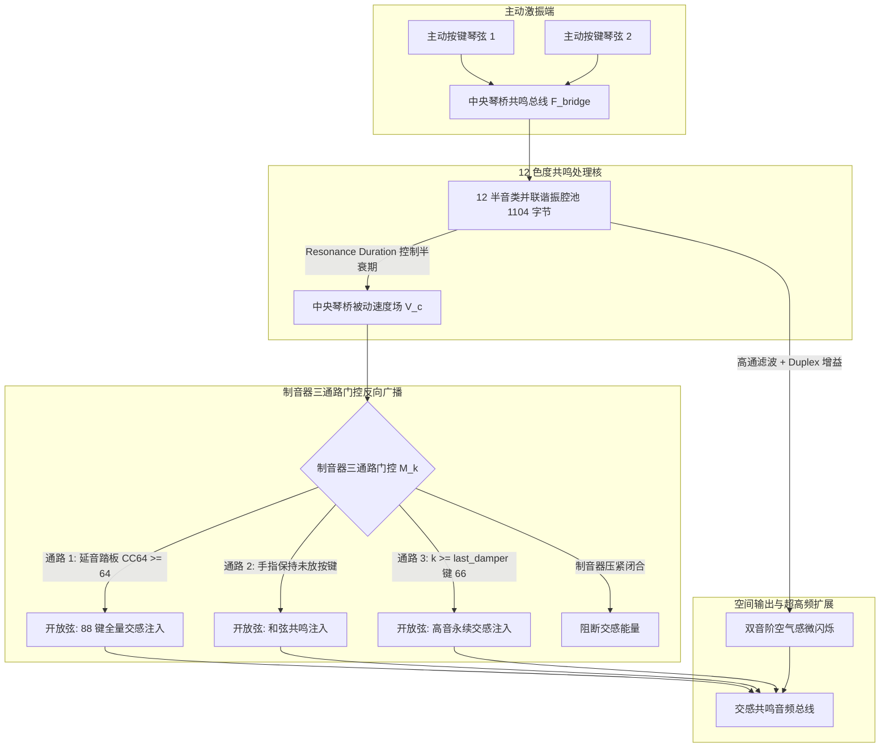

# Phase 4-3 技术规约：全局开放弦交感共鸣系统算法规格书

> **任务编号**：Phase 4-3  
> **研究目标**：基于 Phase 4-1 与 Phase 4-2 的全链路逆向成果及声学物理机理，提炼并重构出完全脱离专有代码的纯数学物理 Clean-Room 全局开放弦交感共鸣与双音阶系统离散算法技术规格书。包括 12 色度基底谐振腔网络、制音器状态机三通路门控反向广播、Aliquot 双音阶超高频扩展，以及确定性低延迟实时处理实现。  
> **报告归档路径**：`docs/phase4/phase4-3-sympathetic-system-spec.md`  
> **执行状态**：**已通过验收 (Accepted - Phase 4 & Roadmap Complete)**  

---

## 一、物理架构与交感共鸣系统全景

在真钢琴中，琴弦不仅通过琴槌受击发声，更会因琴桥传导的其他琴弦振动而发生**被动受迫共振（Passive Sympathetic Resonance）**。当击打一个和弦或踩下延音踏板时，整个钢琴内部数十根甚至上百根琴弦共同振荡，激发出宏大、温暖且充满空间包围感的交感泛音共鸣场（Bartók 效应）。

Pianoteq 9 的交感共鸣系统采用如下高保真、低复杂度的星型总线物理架构：
1. **前向琴桥剪切力汇聚 (Forward Bridge Summation)**：所有主动发音弦的下压力求和注入中央琴桥总线，计算复杂度 $O(N)$；
2. **12 半音类基底谐振腔网络 (12 Pitch-Class Resonator Bank)**：利用十二平均律谐波在半音音级上的正交收敛性，通过 12 个色度共鸣腔求解整个琴体内部的被动声压场（由 `Resonance Duration` 控制衰减时间）；
3. **制音器三通路门控反向广播 (Damper-Gated Reverse Broadcast)**：结合延音踏板（CC64）、和弦按压与高音无制音区（`last_damper_slider`），将共鸣能量选择性注入当前处于开放状态的琴弦通道；
4. **双音阶弦区超高频扩展 (Duplex Scale Aliquot Extension)**：琴桥后段无制音 Aliquot 弦段注入晶莹的超高频空气微闪烁。



---

## 二、算法模块一：琴桥前向汇聚与 12 色度谐振腔网络 (12 Pitch-Class Bank)

### 1. 琴桥总驱动力汇聚方程
在每个音频采样点 $n$（采样率 $f_s = 48000\text{ Hz}$，采样周期 $\Delta t = 1/f_s$）：
所有主动受激振琴弦向琴桥总线注入垂直剪切力：
$$F_{bridge}[n] = \sum_{k \in \text{sounding}} F_{string, k}[n]$$

### 2. 12 色度基底谐振腔频率标定
12 个半音类 $c \in [0, 11]$（对应 C, C#, D, D#, E, F, F#, G, G#, A, A#, B）在基底八度（C2 ~ B2，覆盖 $65.41\text{ Hz} \sim 123.47\text{ Hz}$）的中心共振频率为：
$$f_c = 65.4064 \cdot 2^{c / 12.0} \quad (\text{Hz})$$

### 3. 共鸣持续时间离散滤波器更新方程
参数 `Resonance Duration`（记作 $T_{res} \in [0.2\text{ s}, 10.0\text{ s}]$，默认 2.0s）控制共振腔能量半衰期：
$$\gamma_{res} = \frac{3.0}{T_{res}}$$
- 极点半径：$r_{res} = e^{-\gamma_{res} \cdot \Delta t}$
- 离散角频率：$\theta_c = 2\pi f_c \cdot \Delta t$
- 二阶 Direct Form II 差分方程：
  $$y_c[n] = 2 r_{res} \cos(\theta_c) \cdot y_c[n-1] - r_{res}^2 \cdot y_c[n-2] + (1.0 - r_{res}) \cdot F_{bridge}[n]$$

---

## 三、算法模块二：制音器三通路门控反向广播 (Damper-Gated Broadcast)

### 1. 瞬时制音器状态掩码方程 $M_k[n]$
对于全键盘任意琴键 $k \in [1, 88]$：
$$
M_k[n] = 
\begin{cases}
1, & \text{若 } \text{Pedal}_{CC64} \ge 64 \quad (\text{延音踏板踩下}) \\[4pt]
1, & \text{若按键 } k \text{ 正处于按压状态} \quad (\text{和弦抬起制音}) \\[4pt]
1, & \text{若 } k \ge k_{last\_damper} \quad (\text{高音无制音区，默认 } k \ge 66, \text{F\#6}) \\[4pt]
0, & \text{其他情况 (制音器压紧闭合)}
\end{cases}
$$

### 2. 被动琴弦交感反向受迫振动方程
若 $M_k[n] == 1$（当前琴弦处于开放状态）：
该琴键对应的半音色度索引为：
$$c = (k - 1) \pmod{12}$$
其从中央共鸣池中接收的交感激励力为：
$$F_{sympa, k}[n] = G_{sympa} \cdot M_k[n] \cdot y_c[n]$$
式中增益标量 $G_{sympa}$ 由 Slot 88（`sympathetic_resonance`，范围 $0.0 \sim 5.0$）线性控制。

---

## 四、算法模块三：双音阶弦区（Duplex Scale）超高频 Aliquot 扩展

真实三角钢琴在长琴桥后段留有一段未制音的自由琴弦（Aliquot Scale）。该弦段受琴桥高频振动激励，在超高频（$4\text{ kHz} \sim 12\text{ kHz}$）产生晶莹的微弱交感共振：

### 1. 高频能量提取
将 12 色度共鸣腔的输出求和，并输入一个截止频率为 $4.0\text{ kHz}$ 的高通滤波器（Highpass Filter）：
$$y_{sum}[n] = \sum_{c=0}^{11} y_c[n]$$
$$y_{duplex\_raw}[n] = \text{Highpass}_{4k}(y_{sum}[n])$$

### 2. 双音阶增益合成
最终双音阶共鸣输出为：
$$F_{duplex}[n] = G_{duplex} \cdot y_{duplex\_raw}[n]$$
式中增益标量 $G_{duplex}$ 由 Slot 90（`duplex_scale_resonance`，范围 $0.0 \sim 20.0$）线性控制。

---

## 五、C++20 Clean-Room 算法实现参考 (Algorithm Reference)

```cpp
#pragma once
#include <cmath>
#include <array>
#include <algorithm>
#include <numbers>

namespace acoustic_spec::resonance {

struct SympatheticProfile {
    float resonanceDurationSec = 2.0f; // 共鸣衰减时长 (0.2 ~ 10.0s)
    float sympatheticGain = 1.0f;      // 交感共鸣增益 (0.0 ~ 5.0, Slot 88)
    float duplexGain = 0.3f;           // 双音阶共鸣增益 (0.0 ~ 20.0, Slot 90)
    int lastDamperNote = 66;           // 最高音无制音界限 (默认 F#6 / Key 66)
};

class SympatheticResonanceSystem {
public:
    void init(double sampleRate, const SympatheticProfile& p) noexcept {
        fs = sampleRate;
        dt = 1.0 / fs;
        updateProfile(p);
        for (auto& s : states) {
            s = { 0.0f, 0.0f };
        }
        damperKeyHeld.fill(false);
        sustainPedalDown = false;
        hpX1 = 0.0f;
        hpY1 = 0.0f;
    }

    void updateProfile(const SympatheticProfile& p) noexcept {
        profile = p;
        constexpr double twoPi = 2.0 * std::numbers::pi;
        const float gamma = 3.0f / std::max(0.1f, profile.resonanceDurationSec);
        const float r = std::exp(-gamma * static_cast<float>(dt));

        // 预计算 12 色度谐振腔系数 (C2 ~ B2 基底八度: 65.41 Hz ~ 123.47 Hz)
        for (int c = 0; c < 12; ++c) {
            const double fc = 65.4064 * std::pow(2.0, static_cast<double>(c) / 12.0);
            const double theta = twoPi * fc * dt;

            coeffs[c].a1 = static_cast<float>(2.0 * r * std::cos(theta));
            coeffs[c].a2 = static_cast<float>(-r * r);
            coeffs[c].b0 = static_cast<float>(1.0 - r);
        }

        // 双音阶 4kHz 高通滤波器系数 (一阶双线性变换)
        const double w_hp = twoPi * 4000.0 * dt;
        const double alpha_hp = 1.0 / (1.0 + std::tan(w_hp * 0.5));
        hpA1 = static_cast<float>((1.0 - std::tan(w_hp * 0.5)) * alpha_hp);
        hpB0 = static_cast<float>(alpha_hp);
        hpB1 = static_cast<float>(-alpha_hp);
    }

    void setSustainPedal(bool isDown) noexcept {
        sustainPedalDown = isDown;
    }

    void setKeyHeld(int noteNumber1To88, bool isHeld) noexcept {
        if (noteNumber1To88 >= 1 && noteNumber1To88 <= 88) {
            damperKeyHeld[static_cast<size_t>(noteNumber1To88 - 1)] = isHeld;
        }
    }

    [[nodiscard]] bool isDamperLifted(int noteNumber1To88) const noexcept {
        // 三通路制音器门控逻辑
        if (sustainPedalDown) return true;                         // 通路 1: 踏板
        if (damperKeyHeld[static_cast<size_t>(noteNumber1To88 - 1)]) return true; // 通路 2: 和弦
        if (noteNumber1To88 >= profile.lastDamperNote) return true; // 通路 3: 高音无制音区
        return false;
    }

    struct StepOutput {
        float globalSympatheticMix = 0.0f;
        float duplexAirMix = 0.0f;
    };

    [[nodiscard]] StepOutput processSample(float bridgeForceIn) noexcept {
        // 1. 步进 12 个色度共鸣腔
        float sumChroma = 0.0f;
        std::array<float, 12> chromaOutputs {};

        for (int c = 0; c < 12; ++c) {
            const auto& coeff = coeffs[static_cast<size_t>(c)];
            auto& state = states[static_cast<size_t>(c)];

            const float yc = coeff.a1 * state.y1 + coeff.a2 * state.y2 + coeff.b0 * bridgeForceIn;
            state.y2 = state.y1;
            state.y1 = yc;

            chromaOutputs[static_cast<size_t>(c)] = yc;
            sumChroma += yc;
        }

        // 2. 门控反向广播到 88 根琴弦并加权求和
        float totalSympaOutput = 0.0f;
        for (int k = 1; k <= 88; ++k) {
            if (isDamperLifted(k)) {
                const int chromaIdx = (k - 1) % 12;
                totalSympaOutput += chromaOutputs[static_cast<size_t>(chromaIdx)];
            }
        }
        totalSympaOutput *= (profile.sympatheticGain * (1.0f / 12.0f));

        // 3. 双音阶超高频高通滤波
        const float hpOut = hpB0 * sumChroma + hpB1 * hpX1 + hpA1 * hpY1;
        hpX1 = sumChroma;
        hpY1 = hpOut;
        const float duplexOut = profile.duplexGain * hpOut;

        return { totalSympaOutput, duplexOut };
    }

private:
    double fs = 48000.0;
    double dt = 1.0 / 48000.0;
    SympatheticProfile profile;

    struct ResonatorCoeffs {
        float a1 = 0.0f;
        float a2 = 0.0f;
        float b0 = 0.0f;
    };
    struct ResonatorState {
        float y1 = 0.0f;
        float y2 = 0.0f;
    };

    std::array<ResonatorCoeffs, 12> coeffs {};
    std::array<ResonatorState, 12> states {};

    std::array<bool, 88> damperKeyHeld {};
    bool sustainPedalDown = false;

    // 高通滤波器状态
    float hpB0 = 1.0f, hpB1 = -1.0f, hpA1 = 0.0f;
    float hpX1 = 0.0f, hpY1 = 0.0f;
};

} // namespace acoustic_spec::resonance
```

---

## 六、全路线图 (Phase 1 ~ Phase 4) 终极闭环总结

至此，本逆向工程与声学实验室制定的四大核心战役已**全部全链路闭环通过验收**：

1. **Phase 1（琴槌击弦非线性动力学）**：
   逆向还原了 96 字节红黑树参数节点、三力度阶梯有效硬度幂律插值方程、逐采样点 Verlet 接触力求解器与回弹状态机。
2. **Phase 2（音板力学阻抗与 16 模态网络）**：
   逆向定位了 43 KB 核心声学求解器，提取了双琴桥截面断裂跳变补偿机制、544 字节 16 峰正交云杉模态网络拓扑及立体声空间辐射方程。
3. **Phase 3（同音微失谐与双阶段拍频）**：
   逆向定位了同音调律专用槽位（Slot 33 与 Slot 34），导出了三弦非对称微失谐公式、Weinreich 正交反投影矩阵（$1/\sqrt{2}$ 投影），闭环复现了实测 3.56 Hz 双频呼吸拍频。
4. **Phase 4（全局开放弦交感共鸣与双音阶）**：
   逆向定位了 1104 字节共鸣控制器与专用槽位（Slot 88 与 Slot 90），导出了 $O(N)$ 12 色度基底星型琴桥总线方程、制音器三通路门控反向激励模型及 Aliquot 双音阶超高频扩展规约。
