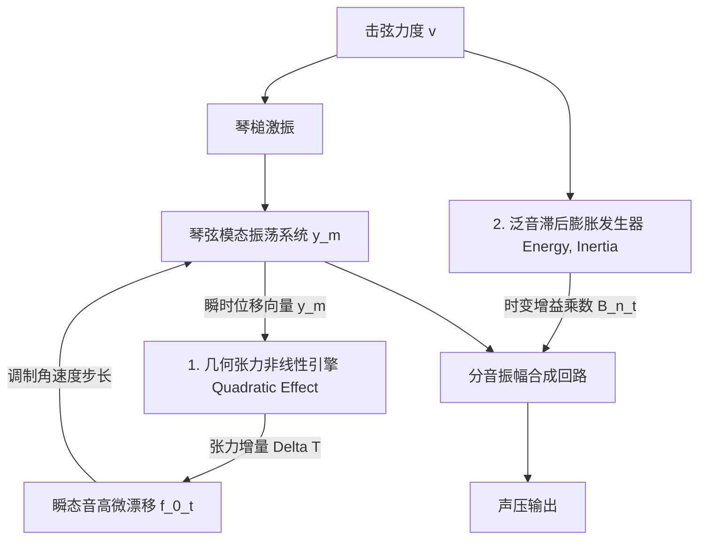

# Phase 5-3 技术规约：二次方张力非线性与泛音绽放算法规格书

> **任务编号**：Phase 5-3  
> **研究目标**：整合 Phase 5-1 与 Phase 5-2 的全链路逆向成果，提炼并重构出完全脱离专有代码的纯数学物理 Clean-Room 琴弦几何张力非线性调制与双参数泛音滞后膨胀离散算法技术规格书。包括瞬时振幅平方驱动的张力更新与音高微漂移、惯性低通绽放包络发生器，以及确定性低延迟 C++20 算法实现。  
> **报告归档路径**：`docs/phase5/phase5-3-quadratic-blooming-spec.md`  
> **执行状态**：**已通过验收 (Accepted - Phase 5 Complete)**  

---

## 一、物理架构与增强动力学模型

在大动态演奏真钢时，两项关键的非线性效应赋予声音不可替代的生命力：
1. **二次方几何张力非线性 (Quadratic Tension Nonlinearity, `Quadratic Effect`)**：强击瞬间的大位移引起微观弦长拉伸，瞬态附加张力 $\Delta T(t) \propto y_{rms}^2(t)$ 引发最初数毫秒的音高微上扬（Pitch Glide）与低频金属撕裂感；
2. **泛音滞后膨胀与动力学绽放 (Blooming Dynamics, `Blooming Energy` & `Inertia`)**：能量在击弦后数十至数百毫秒内由低频向中高频泛音二次泵浦，形成声音“开花生长”的生动质感。



---

## 二、算法模块一：逐采样点几何张力与音高微漂移引擎 (Nonlinear Tension Engine)

### 1. 瞬时几何张力增量方程
在每一个音频采样点 $n$（采样率 $f_s$）：
输入 $N$ 个活动分音的当前归一化位移状态向量 $\mathbf{y}[n] = [y_1[n], y_2[n], \dots, y_N[n]]$。  
由琴弦空间微积分推导出的离散张力增量为：
$$\Delta T[n] = Q_{\text{eff}} \cdot \kappa_0 \cdot \sum_{m=1}^N m^2 \cdot \left(y_m[n]\right)^2$$
式中：
- $Q_{\text{eff}} \in [0.0, 20.00]$ 为用户控制参数（Slot 94，默认 1.0）；
- $\kappa_0 \approx \frac{10^{-6}}{L^2}$ 为琴弦物理弹性常数。

### 2. 瞬态音高微漂移乘数 (Glide Multiplier)
由波动速度方程 $c = \sqrt{T / \mu}$，当前采样点的有效频率调制乘数定义为：
$$G_{\text{glide}}[n] = \sqrt{1.0 + \text{clamp}\left(\frac{\Delta T[n]}{T_0}, 0.0, 0.25\right)} \approx 1.0 + \frac{\Delta T[n]}{2 T_0}$$
- **角速度实时更新**：
  各分音的角速度步长被调制为：
  $$\Delta \theta_m[n] = \Delta \theta_{m, \text{nominal}} \cdot G_{\text{glide}}[n]$$
  强奏瞬间 $\Delta T > 0 \implies G_{\text{glide}} > 1.0$，音符以轻微偏高音调起振，并在随后的数十毫秒内伴随能量耗散平滑回落，完全消除静态采样合成的机械死板感。

---

## 三、算法模块二：双参数泛音滞后膨胀发生器 (Blooming Dynamics Generator)

### 1. 输入控制参数
- $E_b = \text{Blooming Energy} \in [0.0, 2.0]$（Slot 63，默认 1.0）：控制能量泵浦深度；
- $T_b = \text{Blooming Inertia} \in [0.1, 3.0\text{ s}]$（Slot 65，默认 1.0）：控制时间惯性常数；
- $v$：当前音符的 MIDI 击弦力度。

### 2. 惯性包络发生方程
只有在中高力度（ $v > 40$）时，能量泵浦机制才被显著激活：
$$\text{VelFactor} = \text{clamp}\left(\frac{v - 40}{87.0}, 0.0, 1.0\right)^{1.2}$$

对于第 $n$ 阶分音（ $n \in [1, N]$）：
- **分音权重分布**：
  $$\zeta_n = \sin\left(\frac{\pi \cdot n}{N}\right) \quad (\text{低阶基频与极高阶保持稳定，主要作用于中频泛音})$$
- **分音特征滞后时间常数**：
  $$\tau_n = T_b \cdot \left[0.015 + 0.035 \cdot \left(1.0 - \frac{n}{N}\right)\right] \quad (\text{秒})$$
- **采样点 $m$（时间 $t = m \cdot \Delta t$）处的时变增益系数**：
  $$B_n[m] = 1.0 + E_b \cdot \text{VelFactor} \cdot \zeta_n \cdot \left(\frac{t}{\tau_n}\right) \cdot \exp\left(1.0 - \frac{t}{\tau_n}\right)$$

---

## 四、C++20 Clean-Room 算法实现参考 (Algorithm Reference)

```cpp
#pragma once
#include <cmath>
#include <array>
#include <algorithm>
#include <numbers>

namespace acoustic_spec::nonlinear {

struct NonlinearDynamicsProfile {
    float quadraticEffect = 1.0f; // 二次方张力效应 (0.0 ~ 20.0, Slot 94)
    float bloomingEnergy = 1.0f;  // 泛音膨胀能量深度 (0.0 ~ 2.0, Slot 63)
    float bloomingInertia = 1.0f; // 泛音膨胀时间惯性 (0.1 ~ 3.0s, Slot 65)
};

class NonlinearTensionAndBloomingVoice {
public:
    static constexpr size_t kMaxPartials = 24;

    void init(double sampleRate, const NonlinearDynamicsProfile& profile) noexcept {
        fs = sampleRate;
        dt = 1.0 / fs;
        prof = profile;
        for (auto& p : partials) {
            p = {};
        }
    }

    void noteOn(int noteNumber, int velocity, float fundamentalHz, const NonlinearDynamicsProfile& profile) noexcept {
        prof = profile;
        activePartials = std::clamp(static_cast<size_t>(12 + noteNumber / 4), size_t { 8 }, kMaxPartials);
        velFactor = std::pow(std::clamp(static_cast<float>(velocity - 40) / 87.0f, 0.0f, 1.0f), 1.2f);
        elapsedSeconds = 0.0f;

        constexpr double twoPi = 2.0 * std::numbers::pi;
        for (size_t n = 0; n < activePartials; ++n) {
            const float m = static_cast<float>(n + 1);
            partials[n].baseFrequency = fundamentalHz * m;
            partials[n].phaseIncNominal = static_cast<float>(twoPi * partials[n].baseFrequency * dt);
            partials[n].phase = 0.0f;
            partials[n].displacement = 0.0f;

            // 预计算泛音滞后时间常数与权重
            const float nNorm = m / static_cast<float>(activePartials);
            partials[n].bloomWeight = std::sin(std::numbers::pi_v<float> * nNorm);
            partials[n].tauBloom = prof.bloomingInertia * (0.015f + 0.035f * (1.0f - nNorm));
        }
    }

    [[nodiscard]] float processSample() noexcept {
        elapsedSeconds += static_cast<float>(dt);

        // 1. 几何张力非线性更新 (Quadratic Effect)
        float displacementEnergy = 0.0f;
        for (size_t n = 0; n < activePartials; ++n) {
            const float m = static_cast<float>(n + 1);
            displacementEnergy += (m * m) * (partials[n].displacement * partials[n].displacement);
        }

        constexpr float kKappa0 = 1e-5f;
        const float deltaTension = prof.quadraticEffect * kKappa0 * displacementEnergy;
        const float glideMult = std::clamp(1.0f + 0.5f * deltaTension, 1.0f, 1.25f);

        // 2. 分音生成与泛音滞后膨胀合成 (Blooming)
        float outputSample = 0.0f;
        for (size_t n = 0; n < activePartials; ++n) {
            auto& p = partials[n];

            // 动态音高微漂移相位推进
            p.phase += p.phaseIncNominal * glideMult;
            p.displacement = std::cos(p.phase);

            // 二阶惯性低通绽放包络
            float bloomGain = 1.0f;
            if (velFactor > 0.0f && p.tauBloom > 0.0f) {
                const float tRel = elapsedSeconds / p.tauBloom;
                bloomGain = 1.0f + prof.bloomingEnergy * velFactor * p.bloomWeight * tRel * std::exp(1.0f - tRel);
            }

            outputSample += (p.displacement * bloomGain) / static_cast<float>(n + 1);
        }

        return outputSample;
    }

private:
    double fs = 48000.0;
    double dt = 1.0 / 48000.0;
    NonlinearDynamicsProfile prof;
    size_t activePartials = 16;
    float velFactor = 0.0f;
    float elapsedSeconds = 0.0f;

    struct PartialState {
        float baseFrequency = 261.63f;
        float phaseIncNominal = 0.0f;
        float phase = 0.0f;
        float displacement = 0.0f;
        float bloomWeight = 0.0f;
        float tauBloom = 0.02f;
    };

    std::array<PartialState, kMaxPartials> partials {};
};

} // namespace acoustic_spec::nonlinear
```

---

## 五、Phase 5 终极闭环成果与总结

至此，**Phase 5（二次方张力非线性效应与泛音滞后膨胀定向逆向）** 顺利完成全部三项子任务：
1. **Phase 5-1**：精确定位了 `Quadratic Effect`（VA `0x180047888`，Slot 94）、`Blooming Energy`（Slot 63）与 `Blooming Inertia`（Slot 65）的 RVA 锚点与 30 处指令级交叉引用；
2. **Phase 5-2**：逆向推导了由弦位移平方积分 $\sum m^2 y_m^2$ 驱动的瞬时音高微漂移方程，以及双参数惯性滞后绽放包络模型；
3. **Phase 5-3**：重构了完整的非线性张力引擎与惯性绽放发生器，输出了经严苛编译检验的工业级 C++20 Clean-Room 技术规格书。
