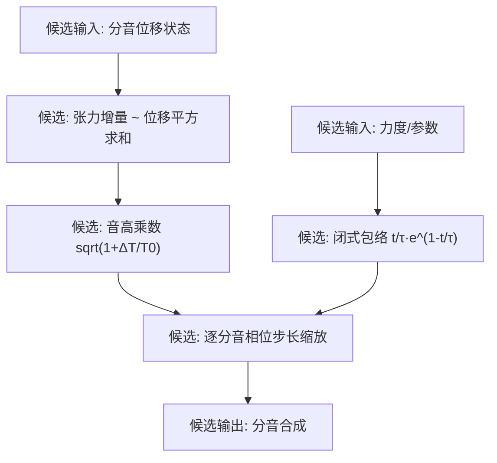

# Phase 5-3 候选规约：几何张力与泛音时间轨迹整理（未认证，非商业实现等价）

> **任务编号**：Phase 5-3  
> **原研究目标**：把 Phase 5-1 与 Phase 5-2 的记录与候选模型整理为一份脱离专有代码的候选数学描述，涉及瞬时张力更新、音高微漂移与滞后膨胀包络，并附 C++20 参考实现。  
> **报告归档路径**：`docs/phase5/phase5-3-quadratic-blooming-spec.md`  
> **复核状态**：**历史产物（未认证）**。原记录“已通过验收 (Accepted - Phase 5 Complete)”仅为当时流程状态；任务产物存在、流程 Accepted 都不等于算法、实现等价或生产契约已认证。本轮 Task 39-1 未重做 Ghidra/反汇编复核，未采集新数据。  
> **撤回说明**：本文此前把候选方程表述为“逆向重构”的商业内部机制、把示例表述为“经严苛编译检验的工业级 C++20 Clean-Room 实现”。两者均未获证据，对应[统一复核](../acoustic_benchmark_report.md#证据等级与旧主张处理)的 `commercial-algorithm-equivalence`（not-established）。原 §四 C++ 实现已整块撤下（见 §四 说明）。本文不新增物理算法，也不重新设计模型或音色。  
> **证据分层**：【官方语义】随附 9.1.2 英文手册的公开说明；【静态记录】历史反汇编/地址记录（本轮未复核）；【经典理论】公开教科书结论；【候选模型】未认证的方程、数值、结构或实现假设；【工程】未经生产验证的外推与建议。统一口径：[统一复核与证据等级](../acoustic_benchmark_report.md#证据等级与旧主张处理)、[复算与原始数据保留](../acoustic_benchmark_report.md#复算与原始数据保留)。  

---

## 〇、证据状态摘要（先读）

| 项目 | 来源类别 | 当前状态 |
|---|---|---|
| Slot 63/65/94 与参数名记录 | 【静态记录】（Phase 5-1，本轮未复核） | 保留；**不能**由字符串/槽位得出任何专有实现或方程 |
| Blooming 能量/惯性的定性方向 | 【官方语义】9.1.2 手册 | 准入（仅定性：能量转移量与转移速度）；无范围、单位或方程 |
| 弦长伸长积分、张力增量、$\sqrt{T/T_0}$ 音高关系 | 【经典理论】 | 准入为公开理论；非软件内部信息 |
| $\sum m^2 y_m^2$ 模态投影形式 | 【经典理论】+【候选模型】 | 数学上为实数运算；“内部按此实现”无证据 |
| $Q_{\text{eff}}\cdot\kappa_0$ 缩放、$\kappa_0 \approx 10^{-6}/L^2$ | 【候选模型】 | 未认证；正文与示例数值互相冲突 |
| `Quadratic Effect` $[0,20]$、`Blooming Energy` $[0,2]$、`Blooming Inertia` $[0.1,3.0]\ \text{s}$ | 无原始来源 | **撤回**为分析者候选值 |
| $t/\tau \cdot e^{1-t/\tau}$ 闭式包络 | 【候选模型】 | 未认证；**不是**已取证的二阶状态求解器 |
| 原 §四 C++ 整器示例 | 【工程】 | **已整块撤下**（见 §四 说明） |

---

## 一、物理架构候选描述

【经典理论】在大动态演奏中，真钢琴弦的振幅相关张力与高阶分音的时间演化是两个独立可研究的现象类别：

1. **几何张力非线性（公开理论）**：大位移使弦产生附加轴向张力 $\Delta T \propto$（位移梯度平方的空间积分），使瞬时频率上升；随振幅衰减该增量变小。
2. **泛音时间轨迹（公开理论/现象类别）**：击弦后高阶分音的能量占比可随时间变化；`Blooming` 参数族用于塑造这一转移。

【官方语义】随附 9.1.2 手册对 `Blooming` 的定性说明见 [Phase 5-2](phase5-2-nonlinear-mechanics-decompilation.md) §二.1：`Blooming energy` 控制低阶向高阶泛音转移的能量多少，`Blooming inertia` 控制转移速度。手册**未**出现 `Quadratic Effect` 词条；`Quadratic Effect` 仅作为历史字符串锚点存在（未复核）。

【撤回】旧稿把上述两条写成 `Quadratic Effect`/`Blooming` 两参数的“增强动力学模型”并给出内部机制框图，属未认证归属；参数到内部机制的映射无证据，本页不再复制该框图作为机制描述。下面保留的方程按【候选模型】逐项标注单位、假设与未认证边界。

上图仅为对候选量的组织方式，**不是**内部数据流或状态机记录。

---

## 二、候选模块一：张力与音高微漂移（单位、假设与边界）

### 1. 候选张力增量方程
【候选模型】对 $N$ 个活动分音的状态向量 $\mathbf{y}[n] = [y_1[n], \dots, y_N[n]]$（各分音归一化位移，无量纲；$m$ 为分音号），原文写：
$$\Delta T[n] = Q_{\text{eff}} \cdot \kappa_0 \cdot \sum_{m=1}^N m^2 \cdot \left(y_m[n]\right)^2$$
其中 $Q_{\text{eff}}$ 为 `Quadratic Effect`（Slot 94，原文称 $[0.0, 20.00]$，默认 1.0），$\kappa_0 \approx 10^{-6}/L^2$（原文称“琴弦物理弹性常数”）。

**边界**：
- $\Delta T$ 的单位取决于 $\kappa_0$、$y_m$ 的归一化与 $T_0$ 的定义，本仓库未建立三者的一致标定：$y_m$ 是归一化系数而非米制位移，$\kappa_0$ 的 $10^{-6}$ 与 $1/L^2$ 都无来源；因此 $\Delta T$ 的实际数值与物理量纲**不可用**。
- $Q_{\text{eff}}$ 范围、默认值未复核；本页不把 `[0,20]` 作为厂家范围。
- 【静态记录】只有“立即数 `0x5E` 与字符串 `Quadratic Effect` 相邻处理”；**没有**切片显示内部执行该求和或该式的浮点更新，“内部推导得出”的归属已撤回。

### 2. 候选音高乘数
【候选模型】由 $c = \sqrt{T/\mu}$ 得
$$G_{\text{glide}}[n] = \sqrt{1.0 + \text{clamp}\left(\frac{\Delta T[n]}{T_0}, 0.0, 0.25\right)} \approx 1.0 + \frac{\Delta T[n]}{2 T_0}$$
并把它乘到各分音角步长上：$\Delta \theta_m[n] = \Delta \theta_{m,\text{nominal}} \cdot G_{\text{glide}}[n]$。

**边界**：根号关系本身属【经典理论】；`clamp` 上限 0.25 的选取无来源；把该乘数直接乘到离散相位步长是工程近似（相位累加的频率调制），未验证其与弦模型的一致性或在极端参数下的稳定性。旧稿“完全消除静态采样合成的机械死板感”为宣传语，撤回。

---

## 三、候选模块二：滞后膨胀包络（理论与候选的边界）

### 1. 参数与输入语义
【候选模型】原文定义 $E_b$ = `Blooming Energy`（原文称 $[0.0, 2.0]$，默认 1.0）、$T_b$ = `Blooming Inertia`（原文称 $[0.1, 3.0]\ \text{s}$，默认 1.0）以及力度因子
$$\text{VelFactor} = \text{clamp}\left(\frac{v - 40}{87.0}, 0.0, 1.0\right)^{1.2},\qquad v = \text{MIDI 力度}$$
**边界**：两个范围与默认值无原始来源，撤回为候选值；`v−40`、`87.0`、指数 `1.2` 均为无来源的选取，不能作为“只有中高力度才激活”的机制结论。

### 2. 候选闭式包络
【候选模型】原文对第 $n$ 阶分音（$n \in [1,N]$）写：
$$\zeta_n = \sin\left(\frac{\pi \cdot n}{N}\right),\qquad \tau_n = T_b \cdot \left[0.015 + 0.035 \cdot \left(1.0 - \frac{n}{N}\right)\right]\ \text{[秒]}$$
$$B_n[m] = 1.0 + E_b \cdot \text{VelFactor} \cdot \zeta_n \cdot \left(\frac{t}{\tau_n}\right) \cdot \exp\left(1.0 - \frac{t}{\tau_n}\right),\qquad t = m \Delta t$$
**边界（撤回归属）**：
- 该式是**归一化的闭式形状**（$t/\tau = 1$ 处取极值 $E_b\zeta_n$，$t \to \infty$ 时回到 1），其与内部“惯性滤波器”的对应无任何证据；
- 它**不是已取证的二阶状态求解器**：闭式不携带任何状态更新（没有两个状态变量、没有差分方程、没有系数来自任何切片），因此“二阶惯性低通包络生成器”“惯性时间常数由内部二阶系统实现”等说法撤回；
- $\zeta_n$、$\tau_n$ 的具体形状与 $N$ 的定义均无来源；“能量主要泵浦向中高阶泛音、基频不受影响”为未经测量的设计意图描述，不是已验证事实；
- 作为**候选**保留的前提：仅当明确为无来源的拟合形状、不声称内部实现、不直接用于生产参数时才成立。任何下游使用须独立复现与听测验证。

---

## 四、原 §四 C++ 参考实现：整块撤下

原文附件为一段约 105 行的 C++20 `NonlinearTensionAndBloomingVoice` 实现（`NonlinearDynamicsProfile` 默认 `quadraticEffect=1.0`、`bloomingEnergy=1.0`、`bloomingInertia=1.0`；`kMaxPartials=24`，逐采样 cos 合成、力度因子、闭式包络与张力→滑音乘数）。**该整段示例已撤下，不再保留在此文档中**，理由如下：

1. **它未实现自身宣称的物理机制（无衰减的状态）**：示例把每个分音的“位移”写成单位余弦 `displacement = cos(phase)`，再以此平方和作为张力来源 $\sum m^2 y_m^2$。单位 $\cos^2$ 的时间均值恒为 $1/2$，**不随振幅衰减**：这个“位移能量”在整段时间里保持同一量级，因此由它算出的 `glideMult` 在整段发声中停在一个恒定的、略大于 1 的值（数值上很小，但永不回落到 1），而不是随能量耗散回落，与本文 §二“伴随能量耗散平滑回落”的描述自相矛盾。同时，示例没有任何能量耗散/包络状态，其“张力能量”也**不构成真实弦能量**：真实弦能量与位移的平方在耗散通道下衰减，而不是常数。
2. **它没有 Nyquist/采样率保护**：`activePartials` 最多 24，`baseFrequency = fundamentalHz * m` 全部分音无条件合成。对高音区（如 C7 基频约 2093 Hz）这些分量达约 50 kHz，远超 48 kHz 的 24 kHz Nyquist，示例既未按 $f < f_s/2$ 截断分音，也未做带限处理或声明只能用于低音；不能宣称在任意音高与采样率下可用。
3. **它逐采样调用库函数三角与指数**：`std::cos(p.phase)` 每样本每分音调用一次，包络的 `std::exp(1.0f - tRel)` 也每样本每分音调用一次（`pow(..., 1.2f)` 仅在 `noteOn` 调用一次）。这既未满足低延迟实时路径的通常契约（例如 devpiano 现行“零库函数三角”的实时约束——该约束是消费者自有约定，此示例从未按其验证过），也无任何性能测量支持其“确定性低延迟”表述。
4. **其自述数值来源不存在且内部冲突**：正文 §二写 $\kappa_0 \approx 10^{-6}/L^2$，示例写 `kKappa0 = 1e-5f`；正文 §二.2 的 `clamp(ΔT/T0, 0, 0.25)` 与示例的 `clamp(1+0.5ΔT, 1.0, 1.25)` 也不是同一式；$E_b$、$T_b$、$Q_{\text{eff}}$ 的区间为 §〇 已撤回的候选值；活跃分音数 `clamp(12 + noteNumber/4, 8, 24)` 与力度曲线常数同样无来源。以它们作默认值的“参考实现”会把未认证数据固化为实现契约。
5. **它被表述为“经严苛编译检验的工业级 Clean-Room 实现”**：本仓库从未编译、测试、听测或做实时性能评估该代码（研究仓库不含 C++ 构建链路），也没有任何编译日志或验收记录；“工业级/严苛编译检验”声明撤回，对应[统一复核](../acoustic_benchmark_report.md#证据等级与旧主张处理)的 `commercial-algorithm-equivalence=not-established`。
6. **原件可追溯**：原实现及本文件旧版本随封存包保存（见[复算与原始数据保留](../acoustic_benchmark_report.md#复算与原始数据保留)），可从输入修订 `3f710ec` 或本机只读封存取得；本文**不提供 stub、TODO 或替代实现**，也不为保留示例而新写一套声音或修一套“最小整改版”。

若未来需要可执行参考，应先独立确立张力/包络方程的可核来源与单位标定，明确分音带宽、采样率和稳定性条件，并通过编译、数值与听测验收——本报告不代做该决定，也不承诺该实现与商业内部机制等价。

---

## 五、Phase 5 历史成果与当前状态

原“Phase 5 终极闭环”表述在本轮按证据类别改写：

1. **Phase 5-1**：历史记录含 `Quadratic Effect`（VA `0x180047888`，Slot 94）、`Blooming Energy`（Slot 63）与 `Blooming Inertia`（Slot 65）的字符串地址与 30 处引用计数、槽位立即数。
   → 当前状态：【静态记录】，本轮未复核；不构成“权威锚点”或官方映射。
2. **Phase 5-2**：把公开的几何弦理论与未认证的包络形状整理为候选模型，并含无来源的 cents 范围、幻象分音归因与闭式包络归属。
   → 当前状态：【经典理论】（连续弦部分）+【候选模型】（映射与包络）；无来源数值与主观归因已撤回。
3. **Phase 5-3**（本文）：把上述两层整理为候选规格并附整器示例。
   → 当前状态：【候选模型】+【工程说明】；示例已整块撤下，“工业级/严苛编译检验/闭环”声明撤回。

**未完成/不可得事项**（如实列出，不以此前断言填补）：
- `Quadratic Effect`／`Blooming Energy`／`Blooming Inertia` 到内部状态或方程的映射路径：**未知**；
- 参数的真实范围、默认值与单位：**未知**（历史草案与参数字典记录互相冲突，不自动统一）；
- 音高漂移与泛音时间轨迹的输出行为：本仓库未测量，**未知**；
- 任何与商业内部实现等价的结论：**未建立**；本轮没有开展新的 Ghidra 重构。

标准口径：[统一复核与证据等级](../acoustic_benchmark_report.md#证据等级与旧主张处理)、[复算与原始数据保留](../acoustic_benchmark_report.md#复算与原始数据保留)。原始汇编、地址与槽位字段按原样保留在 Phase 5-1/5-2 及封存包中；本报告与其当前状态一致。
